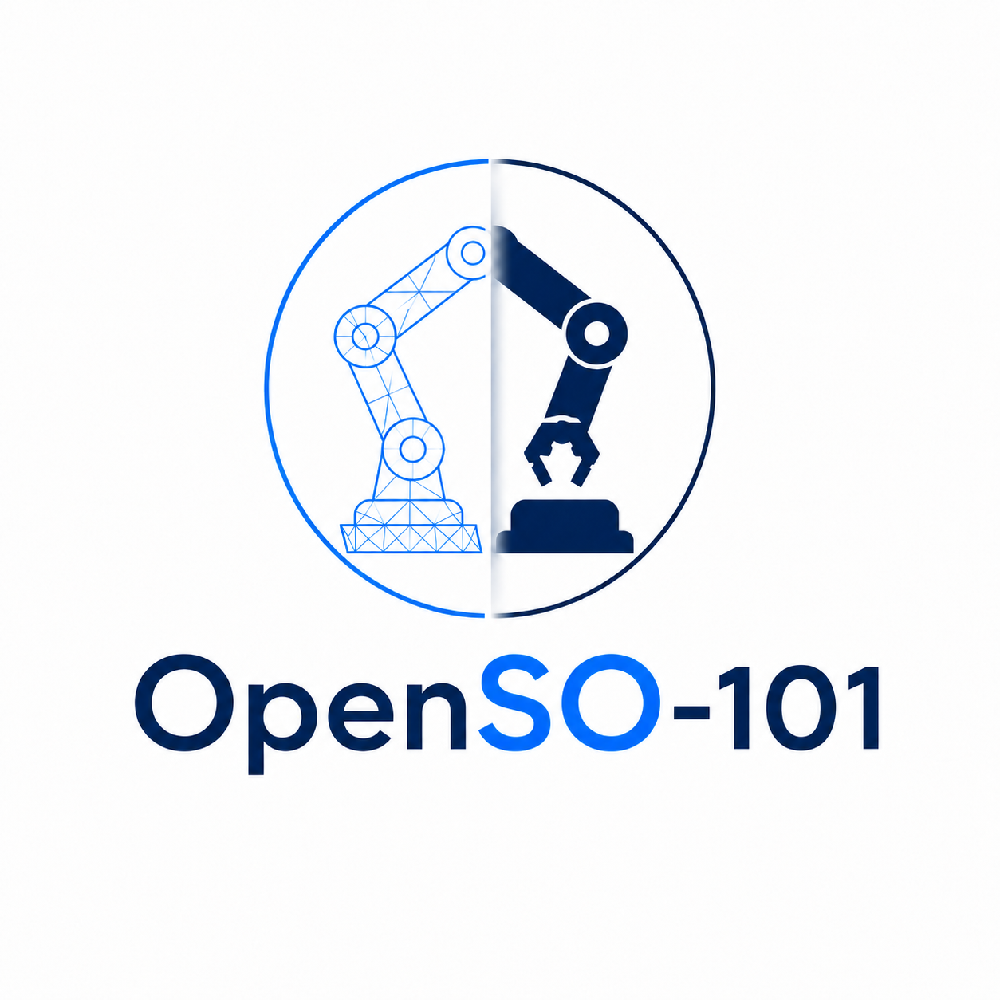

<!--
*** OpenSO-101 — README modelled on https://github.com/othneildrew/Best-README-Template
*** GitHub-flavored markdown. Anchors are kebab-case derived from section titles.
-->

<a id="readme-top"></a>


<!-- PROJECT LOGO -->
<br />
<div align="center">
  <a href="https://github.com/jixinyan/OpenSO-101">
    
  </a>

  <h3 align="center">OpenSO-101</h3>

  <p align="center">
    Open-source robot learning framework for the LeRobot SO-101 in Isaac Lab.
    <br />
    <a href="docs/guides/"><strong>Explore the guides »</strong></a>
    <br />
    <br />
  </p>
</div>


<!-- TABLE OF CONTENTS -->
## Table of Contents

- [About the Project](#about-the-project)
  - [Built With](#built-with)
  - [Repository Layout](#repository-layout)
- [Getting Started](#getting-started)
  - [Prerequisites](#prerequisites)
  - [Installation](#installation)
  - [Quickstart](#quickstart)
- [Usage](#usage)
- [Contributing](#contributing)
- [License](#license)
- [Citation](#citation)
- [Acknowledgements](#acknowledgements)


<!-- ABOUT THE PROJECT -->
## About the Project

OpenSO-101 is an end-to-end unified robot learning framework for the [LeRobot SO-101][so101-url] 6-DoF arm built on [NVIDIA Isaac Lab][isaaclab-url]. It bundles three pillars of modern robot learning behind one CLI and one Python API:

1. **Reinforcement Learning** — PPO via [`rsl_rl`][rsl-rl-url] plus rsl_rl's `Distillation` for teacher → student knowledge transfer.
2. **Imitation Learning** — leader-arm teleop and record data with [LeRobot dataset][lerobot-url] compatible format, and training via the official `lerobot.scripts.train` CLI (ACT, Diffusion).
3. **Sim-to-Real Robustness** — visual, observation, and physics domain randomization shared across all three built-in tasks; a real-arm deploy bridge that drives the Feetech follower via LeRobot's `SO101Follower` while streaming OpenCV camera frames into the policy.

The project is organized so a researcher can clone, install, and reach a working `openso101 envs list` in well under an hour — and so a downstream contributor can register a custom task with one decorator. Each pillar exposes a stable CLI verb and a stable Python entry point; swapping in a custom algorithm or task does not require forking the framework.

<p align="right">(<a href="#readme-top">back to top</a>)</p>


### Repository Layout

```
OpenSO-101/
├── src/openso101/
│   ├── cli/                  # `openso101 {envs,rl,il,sim2real}` dispatch
│   ├── envs/                 # OpenSO101EnvCfg base + register_task decorator
│   ├── robots/so101/         # SO-101 ArticulationCfg, USD spawn, cameras, pose constants
│   ├── tasks/                # Built-in tasks: lift, pick_place, stack (+ shared/)
│   ├── teleop/               # LeRobot leader-arm → simulated follower (async daemon poll)
│   ├── rl/                   # rsl_rl-backed PPO + BestCheckpointRunner; Distillation cfgs
│   ├── il/
│   │   ├── policies/         # ACTPolicy, DiffusionPolicy, load_policy (LeRobot wrappers)
│   │   ├── runners/          # train_il_policy() — programmatic LeRobot trainer
│   │   └── datasets/         # load_lerobot_dataset() — Hub id OR local recorder dir
│   └── sim2real/
│       ├── domain_randomization/  # visual / observation / physics DR (all three tasks)
│       └── deploy.py              # real-arm deploy bridge (LeRobot SO101Follower)
├── scripts/
│   └── install.sh            # uv-based installer (resolves isaaclab/lerobot conflict)
├── docs/guides/              # User-facing guides (install, quickstart, teleop, add_a_task)
├── tests/                    # pytest suite (~21 test modules; full run needs a CUDA GPU + Isaac Sim, a CPU-only subset runs anywhere)
├── constraints.txt           # `setuptools<81` for flatdict's legacy sdist
├── requirements-cuda.txt     # torch cu128 wheels (Blackwell-compatible)
└── pyproject.toml            # `openso101` console_scripts + [tool.uv] resolver overrides
```

<p align="right">(<a href="#readme-top">back to top</a>)</p>


<!-- GETTING STARTED -->
## Getting Started

### Prerequisites

- **Hardware:** an NVIDIA GPU (RTX 20-series or newer; CUDA 12.x). 6 GB+ VRAM recommended for play, 16 GB+ for training.
- **OS:** Ubuntu 22.04 LTS (Isaac Sim 4.5 / 5.1 official target).
- **Driver:** NVIDIA driver ≥ 560.
- **Python:** 3.11 (Isaac Lab is pinned to 3.11).
- **Conda or Mambaforge:** required to keep Isaac Sim's dependency graph isolated.

### Installation

OpenSO-101 ships a single install wrapper that produces a fully-resolved environment in one command:

```bash
# 1. Clone
git clone https://github.com/jixinyan/OpenSO-101.git
cd OpenSO-101

# 2. Create the conda env (Python 3.11 only — heavy deps go in next)
conda env create -f environment.yml
conda activate openso101

# 3. Run the installer (bootstraps uv, installs cu128 torch, then openso101+isaaclab+lerobot)
bash scripts/install.sh

# 4. Fetch the SO-101 USD mesh (~23 MB third-party asset; NOT committed to git)
bash scripts/fetch_so101_usd.sh

# 5. Verify
openso101 envs list
# OpenSO101-Lift-v0
# OpenSO101-PickPlace-v0
# OpenSO101-Stack-v0
```

> **The USD asset is required.** Env construction reads the SO-101 mesh at
> `assets/so101/usd/SO-ARM101-USD.usd`; without it, `envs list` and any
> training/play command raise `FileNotFoundError`. `fetch_so101_usd.sh`
> downloads it from the project's GitHub Release by default. The mesh is a
> third-party binary (~23 MB) authored by Muammer Bay (LycheeAI) and Louis
> Le Lay and is licensed under BSD-3-Clause — see
> [`LICENSE-BSD-3-CLAUSE`](LICENSE-BSD-3-CLAUSE).
> Override the source if you already have the file or host it elsewhere:
>
> ```bash
> # Download from a custom URL (default: the v0.1.0 GitHub Release):
> OPENSO101_SO101_USD_URL=https://github.com/jixinyan/OpenSO-101/releases/download/v0.1.0/SO-ARM101-USD.usd \
>   bash scripts/fetch_so101_usd.sh
>
> # …or copy from a local file you already have:
> OPENSO101_SO101_USD_SRC=/path/to/SO-ARM101-USD.usd bash scripts/fetch_so101_usd.sh
> ```

### Quickstart

**Train PPO on PickPlace** (headless, single GPU, visual DR on):

```bash
openso101 rl train --task OpenSO101-PickPlace-v0 --algo ppo --headless --visual-dr
```

**Distill a PPO teacher into a student** (same task, same checkpoint format):

```bash
openso101 rl train --task OpenSO101-PickPlace-v0 --algo distillation --headless \
  --teacher-checkpoint logs/rsl_rl/pick_place/<teacher-run-dir>
```

**Replay the best checkpoint:**

```bash
openso101 rl play --task OpenSO101-PickPlace-v0 \
  --checkpoint logs/rsl_rl/pick_place/<run-dir>/model_best.pt
```

**Record a teleop demonstration** with a real SO-101 leader arm:

```bash
openso101 il record \
  --task OpenSO101-PickPlace-v0 \
  --leader-port /dev/ttyACM0 \
  --leader-id leader_arm_1 \
  --repo-root teleop_data/openso101_pickplace
```

Recording keys: `S` = save success + exit · `Q` = discard + exit · `C` = checkpoint · `R` = hard-restore to checkpoint. The leader is polled by a daemon thread at ~1 kHz; the simulation reads the latest cached value, so teleop stays smooth even when the sim step takes longer than the bus round-trip.

**Convert the recording to a LeRobot dataset** — `il record` writes HDF5 episodes; the trainer needs a LeRobot-format dataset. `il push` does the HDF5 → LeRobot conversion (and uploads to the Hub):

```bash
openso101 il push \
  --repo-root teleop_data/openso101_pickplace \
  --repo-id <your-hf-username>/openso101_pickplace
```

**Train an IL policy via LeRobot** (delegates to `lerobot.scripts.train`):

```bash
openso101 il train --policy act --dataset <your-hf-username>/openso101_pickplace
# or
openso101 il train --policy diffusion --dataset <your-hf-username>/openso101_pickplace
```

**Play the IL checkpoint in sim** (`il train` writes to `logs/lerobot/openso101_<policy>/<timestamp>/`; the trained weights land under `checkpoints/last/pretrained_model`):

```bash
openso101 il play --task OpenSO101-PickPlace-v0 \
  --policy-path logs/lerobot/openso101_act/<timestamp>/checkpoints/last/pretrained_model
```

**Deploy the same checkpoint on the real robot:**

```bash
openso101 sim2real deploy \
  --policy-path logs/lerobot/openso101_act/<timestamp>/checkpoints/last/pretrained_model \
  --follower-port /dev/ttyACM1 \
  --follower-id follower_arm_1 \
  --wrist-camera-index 0 --overhead-camera-index 2
```

<p align="right">(<a href="#readme-top">back to top</a>)</p>

<!-- USAGE -->
## Usage

The full CLI surface:

| Group | Verb | What it does |
|---|---|---|
| `envs` | `list` | Print registered OpenSO-101 gym IDs |
|        | `random` | N random-action steps as a smoke test |
|        | `zero` | N zero-action steps |
|        | `preview` | Spawn the env with cameras enabled |
| `rl` | `train` | Train an RL policy on a task (`--algo {ppo,distillation}`; `--visual-dr` for lighting + colour DR) |
|      | `play` | Replay an RL checkpoint |
|      | `plot` | Plot training curves from a run dir |
| `il` | `record` | Record teleop demos to HDF5 + LeRobot, with async leader polling |
|      | `push` | Push a LeRobot dataset to the Hugging Face Hub |
|      | `train` | Shell out to `lerobot.scripts.train` (ACT, Diffusion, ...) |
|      | `play` | Load a LeRobot checkpoint and roll it out in sim |
|      | `replay` | Replay a recorded teleop episode |
| `sim2real` | `deploy` | Drive the real SO-101 from a LeRobot checkpoint |

Variants live behind `gym.make` kwargs — one gym ID per task:

```python
import gymnasium as gym
import openso101.tasks  # registers gym IDs

env = gym.make("OpenSO101-PickPlace-v0")                          # default RL config
env = gym.make("OpenSO101-PickPlace-v0", cameras=True)            # add wrist + overhead cameras
env = gym.make("OpenSO101-PickPlace-v0", action_mode="teleop")    # 6-DoF joint-position action
env = gym.make("OpenSO101-PickPlace-v0", play=True)               # fewer envs, no domain randomization
env = gym.make("OpenSO101-PickPlace-v0", visual_dr=True)          # lighting + cube-colour DR
```

Visual DR (`randomize_dome_light_intensity`, `randomize_dome_light_color`, `randomize_object_color`) and observation DR (joint-pos / joint-vel noise) are wired on **all three** built-in tasks: Lift, PickPlace, Stack. Physics DR (mass / friction / payload jitter) is attached unconditionally in each task's `__post_init__`.

Register your own task with one decorator:

```python
from openso101.envs import OpenSO101EnvCfg, register_task

@register_task("MyLab-PourTea-v0")
class PourTeaCfg(OpenSO101EnvCfg):
    def __post_init__(self):
        super().__post_init__()
        # ... your scene, rewards, terminations ...
```

For deep dives, see the guides:

- [Installation](docs/guides/install.md) — fresh Ubuntu 22.04 walkthrough; the uv override explanation.
- [Quickstart](docs/guides/quickstart.md) — install to trained PPO checkpoint in 20 min.
- [Teleop setup](docs/guides/teleop.md) — leader-arm wiring, calibration, recording, key bindings.
- [Add a Custom Task](docs/guides/add_a_task.md) — subclass `OpenSO101EnvCfg`, register, configure variants.

<p align="right">(<a href="#readme-top">back to top</a>)</p>


<!-- CONTRIBUTING -->
## Contributing

Contributions are what make the open-source community such an amazing place to learn, inspire, and create. **Any contribution you make is greatly appreciated.**

If you have a suggestion that would make this better, please fork the repo and create a pull request. You can also simply open an issue with the tag `enhancement`.

1. Fork the project
2. Create your feature branch (`git checkout -b feature/AmazingFeature`)
3. Commit your changes (`git commit -m 'feat: add AmazingFeature'`)
4. Push to the branch (`git push origin feature/AmazingFeature`)
5. Open a Pull Request

Before submitting, please:
- Run the tests. The full suite (~21 test modules under `tests/`) needs a CUDA GPU and Isaac Sim — a bare `pytest tests/` boots the simulator via `conftest.py`, so it only works on a GPU machine. A CPU-pure subset has no Isaac Sim dependency and runs anywhere (e.g. `pytest tests/test_shaping_rewards.py tests/test_cli_rl.py`); CI runs exactly this CPU-only subset.
- Follow the conventions documented in `docs/guides/add_a_task.md`.
- Keep changes scoped — one PR per concern.


<!-- LICENSE -->
## License

Distributed under the MIT License. See [`LICENSE`](LICENSE) for the full text.

The bundled SO-ARM101 USD mesh is © 2025 Muammer Bay (LycheeAI) and Louis Le Lay, licensed BSD-3-Clause; see [`LICENSE-BSD-3-CLAUSE`](LICENSE-BSD-3-CLAUSE). The SO-101 robot configuration in `src/openso101/robots/so101/` (actuator / PD gains) adapts the approach from [`liorbenhorin/lerobot_so101_teleop`](https://github.com/liorbenhorin/lerobot_so101_teleop).

<p align="right">(<a href="#readme-top">back to top</a>)</p>


<!-- CITATION -->
## Citation

If you use OpenSO-101 in your research, please cite it:

```bibtex
@software{openso101,
  title  = {OpenSO-101: An Open-Source Robot Learning Framework for the LeRobot SO-101 in Isaac Lab},
  author = {Yan, Jixin},
  year   = {2026},
  url    = {https://github.com/jixinyan/OpenSO-101}
}
```

<p align="right">(<a href="#readme-top">back to top</a>)</p>


<!-- ACKNOWLEDGEMENTS -->
## Acknowledgements

OpenSO-101 stands on the shoulders of a community of open-source projects:

- [NVIDIA Isaac Lab][isaaclab-url] — the simulation and `ManagerBasedRLEnvCfg` substrate.
- [TheRobotStudio SO-ARM100/SO-ARM101][so101-hardware-url] — the open-hardware arm we target.
- **LycheeAI (Muammer Bay) & Louis Le Lay** — the Isaac-Sim SO-ARM101 USD mesh we redistribute (BSD-3-Clause).
- [liorbenhorin/lerobot_so101_teleop](https://github.com/liorbenhorin/lerobot_so101_teleop) — the SO-101 teleop + actuator/PD-gain approach our robot config adapts.
- [LeRobot][lerobot-url] — teleop drivers, dataset format, ACT/Diffusion training.
- [rsl_rl][rsl-rl-url] — the lean RL library that powers our PPO trainer and Distillation runner.


<p align="right">(<a href="#readme-top">back to top</a>)</p>


<!-- MARKDOWN LINKS & IMAGES -->
[contributors-shield]: https://img.shields.io/github/contributors/jixinyan/OpenSO-101.svg?style=for-the-badge
[contributors-url]: https://github.com/jixinyan/OpenSO-101/graphs/contributors
[forks-shield]: https://img.shields.io/github/forks/jixinyan/OpenSO-101.svg?style=for-the-badge
[forks-url]: https://github.com/jixinyan/OpenSO-101/network/members
[stars-shield]: https://img.shields.io/github/stars/jixinyan/OpenSO-101.svg?style=for-the-badge
[stars-url]: https://github.com/jixinyan/OpenSO-101/stargazers
[issues-shield]: https://img.shields.io/github/issues/jixinyan/OpenSO-101.svg?style=for-the-badge
[issues-url]: https://github.com/jixinyan/OpenSO-101/issues
[license-shield]: https://img.shields.io/github/license/jixinyan/OpenSO-101.svg?style=for-the-badge
[license-url]: https://github.com/jixinyan/OpenSO-101/blob/main/LICENSE

[python-shield]: https://img.shields.io/badge/python-3.11-3776AB?style=for-the-badge&logo=python&logoColor=white
[python-url]: https://www.python.org/
[pytorch-shield]: https://img.shields.io/badge/pytorch-EE4C2C?style=for-the-badge&logo=pytorch&logoColor=white
[pytorch-url]: https://pytorch.org/
[isaaclab-shield]: https://img.shields.io/badge/Isaac%20Lab-76B900?style=for-the-badge&logo=nvidia&logoColor=white
[isaaclab-url]: https://github.com/isaac-sim/IsaacLab
[lerobot-shield]: https://img.shields.io/badge/LeRobot-FFD21E?style=for-the-badge&logo=huggingface&logoColor=black
[lerobot-url]: https://github.com/huggingface/lerobot
[rsl-rl-shield]: https://img.shields.io/badge/rsl__rl-2C3E50?style=for-the-badge
[rsl-rl-url]: https://github.com/leggedrobotics/rsl_rl
[gymnasium-shield]: https://img.shields.io/badge/Gymnasium-0078D4?style=for-the-badge&logo=gymnasium&logoColor=white
[gymnasium-url]: https://gymnasium.farama.org/

[so101-url]: https://github.com/huggingface/lerobot/blob/main/docs/source/so101.mdx
[so101-hardware-url]: https://github.com/TheRobotStudio/SO-ARM100
