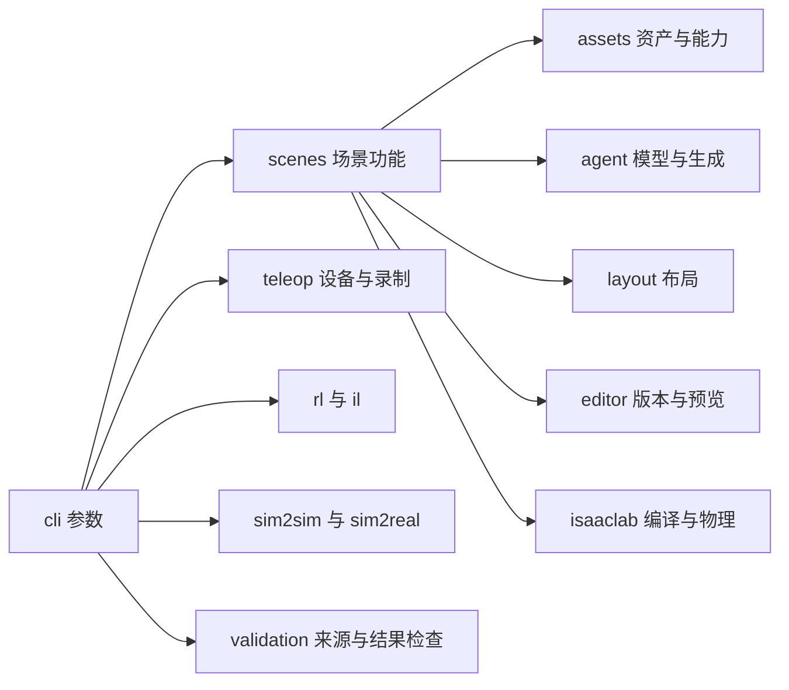

# 代码位置与验证入口

## 功能目录

| 工作内容 | 路径 |
|---|---|
| 命令参数和调用入口 | `src/openso101/cli/` |
| SO-101 资产、关节、相机和 IK | `src/openso101/robots/so101/` |
| Lift、PickPlace、Stack 与共享 MDP | `src/openso101/tasks/` |
| RL 配置、backend、训练和评估 | `src/openso101/rl/` |
| 统一 RL backend 执行与 RSL 原生执行 | `src/openso101/rl/execution.py`、`rsl_execution.py` |
| 全部 TensorBoard event 读取与训练曲线 | `src/openso101/rl/plotting.py` |
| 精确 episode 分配与成功率统计 | `src/openso101/rl/evaluation.py` |
| 实际示范的连续监督 | `src/openso101/rl/sequence_supervision.py` |
| GPU 空闲检查与进程监督 | `src/openso101/rl/gpu_guard.py`、`gpu_scope.py` |
| 场景数据模型、bundle 和任务条件 | `src/openso101/scenes/models.py`、`bundle.py`、`program.py`、`bddl.py` |
| 资产目录、语义索引、几何能力和导入 | `src/openso101/scenes/assets/` |
| 模型接口、任务理解与生成流程 | `src/openso101/scenes/agent/` |
| 布局约束与实际 mesh 检查 | `src/openso101/scenes/layout/` |
| 场景修改、版本保存与交互预览 | `src/openso101/scenes/editor/` |
| USD 编译、Isaac Lab 场景和运行 worker | `src/openso101/scenes/isaaclab/` |
| MP4 输入和米制位置恢复 | `src/openso101/scenes/video.py`、`metric_video.py` |
| 键盘设备、命令类型和终端输入 | `src/openso101/teleop/devices/` |
| 每步目标变化限制、恢复姿态保持 | `src/openso101/teleop/controls.py` |
| 采集 checkpoint、完整场景与任务状态恢复 | `src/openso101/teleop/checkpoints.py` |
| HDF5 与 LeRobot 录制 | `src/openso101/teleop/recorder/` |
| LeRobot 动作单位转换 | `src/openso101/teleop/so101_mapping.py` |
| IL 模型、数据读取与训练 | `src/openso101/il/` |
| IL 训练参数、CPU 准备与 GPU worker | `src/openso101/il/runners/trainer.py`、`preparation.py`、`worker.py` |
| ACT、Diffusion 完整模型的 CPU forward、gradient 与 inference | `src/openso101/il/runners/model_validation.py` |
| LeRobot 权重、processors 与明确 device 加载 | `src/openso101/il/policies/factory.py` |
| 完整模型 checkpoint 保存、加载与实际动作比较 | `src/openso101/il/policies/validation.py` |
| HDF5 检查与 LeRobot 同步、异步导出 | `src/openso101/il/datasets/export.py` |
| LeRobot metadata、episode 范围、统计量与视频文件检查 | `src/openso101/il/datasets/validation.py` |
| IL 关节与 RGB observation | `src/openso101/il/observations.py` |
| IL 原生应用启动、参数检查与关闭 | `src/openso101/il/runtime.py` |
| 窗口与终端录制按键 | `src/openso101/teleop/devices/recording_keys.py` |
| 采集状态、关节恢复与场景回放 | `src/openso101/teleop/sim_state.py` |
| 仿真控制周期与录制 FPS | `src/openso101/teleop/timing.py` |
| MuJoCo 模型、驱动与比较 | `src/openso101/sim2sim/` |
| Domain randomization、student 验证与部署 | `src/openso101/sim2real/` |
| 源码、wheel 和阶段验证 | `src/openso101/validation/` |
| 已保存数据与模型的图表 | `scripts/visualization/` |
| 用户操作指南 | `docs/guides/` |
| 已执行检查的报告与图表 | `docs/validation/` |
| 模型、数据、日志、视频与中间文件 | `outputs/`，由 Git 忽略 |



## CPU 操作

在仓库根目录设置 `PYTHONPATH=src`，将 `CUDA_VISIBLE_DEVICES` 设置为空字符串。`validate source` 检查全部 Python 文件、项目 import、package 文件、Shell 语法和各命令组的实际帮助入口。

```bash
CUDA_VISIBLE_DEVICES='' OPENSO101_SKIP_ISAAC=1 PYTHONPATH=src \
  python -m openso101.cli.main validate source \
  --output outputs/rl_progress/source_check
```

使用 `python -m build --outdir outputs/build` 从 sdist 构建 wheel。构建完成后，通过实际 ZIP、metadata、命令入口和逐文件 SHA256 检查当前源码的打包结果：

```bash
CUDA_VISIBLE_DEVICES='' PYTHONPATH=src \
  python -m openso101.cli.main validate package \
  --wheel outputs/build/openso_101-0.1.0-py3-none-any.whl \
  --output outputs/rl_progress/package_check
```

`jd_B300` 使用已有两个独立环境。统一 CPU 验证包含源码、场景、终端、IK、视频标定、LeRobot 读取、保存模型的动作监督与 MuJoCo。输出目录必须尚未存在。

```bash
OPENSO101_REPO="$PWD" bash scripts/run_cpu_python.sh mujoco \
  -m openso101.cli.main validate run configs/validation/v2_preparation.json \
  --phase cpu --output outputs/rl_progress/v2_cpu_validation
```

GPU 阶段使用相同的源码、配置和输入文件，逐项检查 CPU 报告。设备和停止方式见 [GPU 使用](gpu-usage.md)。当前用户要求保持 GPU 计算停止。

## CPU CI

`.github/workflows/test.yml` 使用 `requirements-cpu-tests.txt` 安装实际运行所需的库。MuJoCo 相机使用 OSMesa。`scripts/fetch_cpu_assets.py` 根据固定 upstream commit 和 SHA256 下载官方 SO-101 XML；已有文件通过同一份 SHA256 检查。

CI 分别保存源码检查、几何与进程检查、PTY 与 Torch 控制检查，以及 sdist、wheel 与 package 核查报告。所执行的检查不启动 Isaac Sim；原生物理和完整任务成功需要对应运行报告。

Ruff 的 `F821`、`F822`、`F823` 检查覆盖源码、脚本和测试中的未定义名称。CPU 接口检查包含实际 PTY、控制数值、配置、RL 命令与 episode 统计。

IL 参数与缺少模型的检查通过实际命令入口执行。完整 CPU 流程使用现有双相机 episode 分别执行同步和异步导出，并通过 LeRobot 读取全部帧，检查 RGB、动作、状态、时间、来源 SHA256 和编码线程关闭。

`recorded_state` 检查实际 HDF5 的全部状态帧在 CPU 上的转换，以及保存的 FPS 和 physics_dt。`student_recorded_inference` 读取已有 student 权重与实际双相机 Lift 记录，验证共享模型入口、RGB 处理与动作单位转换。这两个阶段分别保存原生状态恢复和独立任务成功的验收状态。

`il_training_preparation` 使用实际 LeRobot 数据集，检查 ACT、Diffusion 配置、时间窗口、normalization 和完整 CPU 模型程序。运行入口和记录内容见 [IL 配置与模型检查](il-training.md)。

## Python import

资产管理从 `openso101.scenes.assets.catalog` 导入 `AssetCatalog`，模型接口从 `openso101.scenes.agent.model_client` 导入 `ModelService`，场景修改从 `openso101.scenes.editor.editing` 导入 `SceneEdit`。布局 API 使用 `openso101.scenes.layout`。

键盘设备从 `openso101.teleop.devices.keyboard` 导入 `KeyboardDevice`。命令类型与 `TeleopDevice` 位于 `openso101.teleop.devices.base`。终端输入使用 `openso101.teleop.devices.terminal`。录制器使用 `openso101.teleop.recorder.hdf5` 和 `openso101.teleop.recorder.lerobot`。

Isaac Lab 场景从 `openso101.scenes.isaaclab.runtime` 导入。编译和运行验证分别使用 `python -m openso101.scenes.isaaclab.worker` 与 `python -m openso101.scenes.isaaclab.validation_worker`，通过项目的 GPU 监督入口执行。
