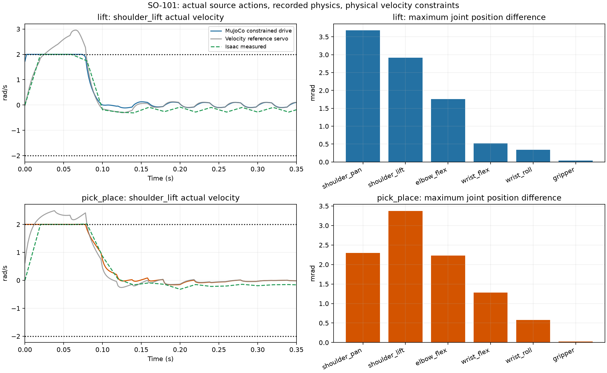
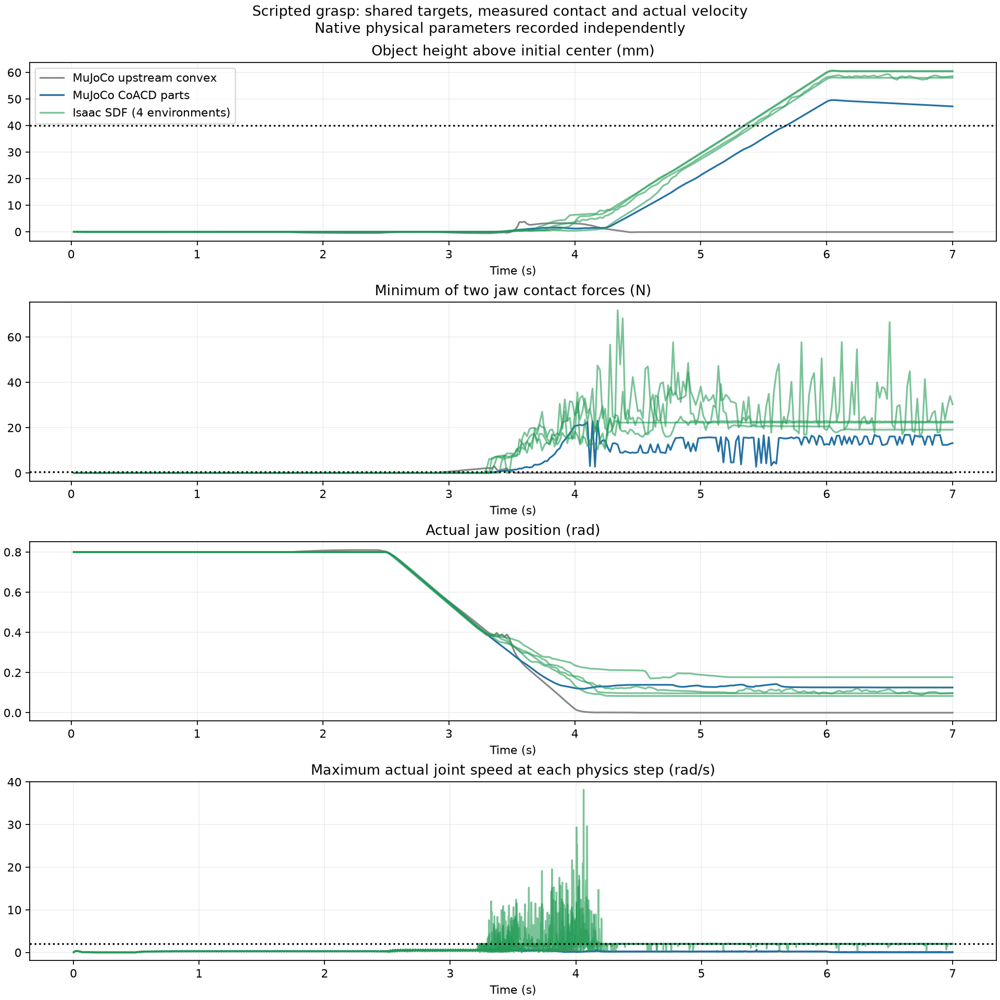

# SO-101 实际动力学与夹爪验收

MuJoCo 使用实际 Isaac 质量、COM、完整惯性、重力、armature、零关节摩擦和 PD。OSQP 求解 implicit PD 力矩，使用独立真实 MuJoCo 步骤预测下一步速度；运行步骤只设置 actuator 的 `ctrl`。每个物理步骤检查实际速度、力矩、预测误差和数值警告。

官方模型采用 SO-ARM100 仓库 `5f6d2b876a53a4872e405b991dd925556c9e38a4` 的 SO-101 old-calibration MJCF 和 STL。六个关节的坐标定义保持经过实际 Isaac 末端姿态检查的转换。机器人质量、COM 与完整惯性使用实际记录，桌面使用原生 USD collision mesh 测量的有限 box。

Jaw 的 0、0.1、0.125、0.35 和 0.8 rad 五个姿态完成独立检查。使用 USD 实际 joint transforms 与 MuJoCo forward kinematics，实体位置最大差异为 0.176 μm，旋转最大差异为 `6.47e-6` rad。该检查核查关节连接、轴向与零位转换，接触表示使用独立验证。原始数据见 [Jaw 关节坐标](jaw_joint_frames.json)。

## 碰撞与参数更新

CoACD 1.0.7 将两个官方夹爪 STL 生成 326 和 237 个 convex parts。每个部件单独建立 collision geom，保持原始 mesh 的位置、quaternion、collision masks 和接触参数。编译后检查七个机器人实体的质量、COM、惯性矩与惯性 quaternion 保持一致。生成参数、全部文件和源 STL SHA256 保存在 collision bundle manifest。

body BVH 的包围盒使用当前 COM 和惯性坐标。实际参数更新会同步转换包围盒，转换依据初始化保存的边界；mesh 内部三角形 BVH 保持原值。真实姿态检查对每个模型重复更新三次，接触数量、接触距离、机器人 geom 姿态和 mesh BVH 均保持一致。原始 convex mesh 模型记录 14 个接触，CoACD 模型记录 200 个接触。

## 相同动作与策略反馈

Mac 和 `jd_B300` 的 Linux CPU 环境分别执行两个任务各四个连续配对片段。每台主机共检查 2600 个控制步骤和 26,000 个物理步骤。输入来自实际 Isaac ActionManager，遇到源 episode 边界结束该片段；期间没有策略反馈计算。

| 指标 | Lift | PickPlace |
|---|---:|---:|
| 每台主机配对环境数量 | 4 | 4 |
| 每台主机控制步骤数量 | 1000 | 1600 |
| 最大关节位置差异，rad | 0.00367943 | 0.00337339 |
| 关节位置 RMSE，rad | 0.00076668 | 0.00047357 |
| 实际关节速度上限，rad/s | 2 | 2 |
| 保存模型的 MuJoCo 任务成功率 | 0/4 | 0/4 |

两台主机的策略、源轨迹、metadata、官方模型与 meshes、控制器、实际参数代码和碰撞 manifest SHA256 一致。逐关节配对指标通过 `1e-7` 范围检查。全部实际速度满足源限制，全部 actuator 力矩满足 ±30 N·m 的仿真配置。该力矩范围属于当前仿真配置，真机电机能力需要设备验证。

独立策略反馈评估使用每个源环境初始参数，随后由保存模型和物理运行生成动作与状态。每台主机共运行八个 episode；成功率均为零。保存模型的原生记录中夹爪目标均为 0.8 rad，双侧抓取接触为零。RL 训练保持停止。

## 夹爪物理检查

`check_gripper_mechanics.py` 使用 scripted IK 控制计划执行接近、关闭、提升与最后一秒保持。两台主机可以通过 `--plan` 读取同一份经过校验的计划。机器人与物体的姿态仅在初始化时设置，随后通过实际 actuator 力矩控制；HDF5 保存完整关节、物体姿态、接触力以及每个物理步骤的速度与力矩。

Mac 的 CoACD 场景完成 350 个控制步骤、3500 个物理步骤，双侧接触持续 181 个控制步骤。最大提升为 49.588 mm，结束时为 47.222 mm；最后一秒的 50 个控制步骤全部保持超过 40 mm 的提升和超过 0.5 N 的双侧接触。该保持阶段最小双侧接触力分别为 12.366 N 和 12.362 N。实际速度与力矩检查通过。

Linux 使用完全相同的共享计划，文件 SHA256 相同，全部目标的最大差异为零。Linux 同样完成 3500 个物理步骤和最后一秒的全部保持检查，最低保持高度为 47.266 mm，最低双侧接触力分别为 12.353 N 和 12.355 N。两台主机的真实物理抓取检查通过；接触力与运动数值保留各自记录。

相同控制器的原始 convex mesh 场景完成全部物理步骤，最大提升为 3.815 mm，超过 40 mm 的持续提升步骤为零。图表使用两项实际 HDF5 记录。

Isaac 的同一共享计划在 0.002 秒物理周期、四次 velocity solver iterations 和 0.1 m/s depenetration 配置下完成四个环境、每环境 3500 个物理步骤。最后一秒均保持双侧接触和超过 40 mm 的提升；接触期间最大实际关节速度为 38.163 rad/s，实际速度限制检查未通过。原生参数包含独立的物理随机化，第三方 USD 使用 SDF 并包含 camera mount collider。接触形状、材质、物理参数与速度约束的共同验收仍待完成；本次保留项目默认 Isaac 配置。完整测量见 [原生夹爪记录](native_gripper.json)和 [验收字段](report.json)。

`render_gripper_trace.py` 使用实际记录的关节和物体 quaternion 渲染 MP4。视频恢复的机器人姿态与源记录误差为零，全部 350 帧解码检查通过，尺寸为 1280×720、50 FPS、时长为 7 秒。原始视频保存在 `outputs/rl_progress/gripper_bvh_verified_coacd/OpenSO101-MuJoCo-grasp.mp4`，视频与轨迹 SHA256 保存在 [视频检查报告](gripper_video.json)。视频展示 scripted IK 物理检查，RL 策略使用独立成功条件。

## 检查入口与来源

正式入口和 collision bundle 的生成方法见 [sim2sim 使用文档](../../../guides/sim2sim.md)。`scripts/collect_constrained_evidence.py` 读取两台主机的实际报告，核查输入 SHA256、配对指标、完整物理采样，以及最后一秒的真实夹爪接触和物体提升。检查失败立即终止。

- [配对动作和物理夹爪验收](report.json)
- [Lift 相同动作](lift_compare.json) · [Linux 相同动作](lift_linux_compare.json)
- [PickPlace 相同动作](pick_place_compare.json) · [Linux 相同动作](pick_place_linux_compare.json)
- [Lift 策略反馈](lift_mujoco.json) · [Linux 策略反馈](lift_linux_mujoco.json)
- [PickPlace 策略反馈](pick_place_mujoco.json) · [Linux 策略反馈](pick_place_linux_mujoco.json)

MuJoCo 的实际速度和力矩、连续动作比较与物理夹爪保持使用各自验收条件。PhysX 接触等价、保存策略的任务成功和真机任务保持未验证。44 项现有 CPU 检查通过，四项包含替代服务或对象的测试未执行。原始模型、日志和实际记录继续保存在 `outputs/rl_progress/`。
