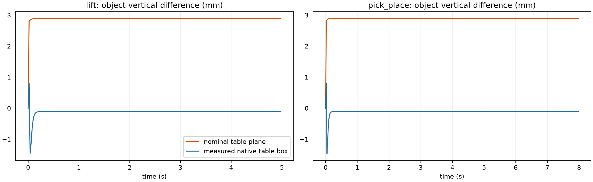
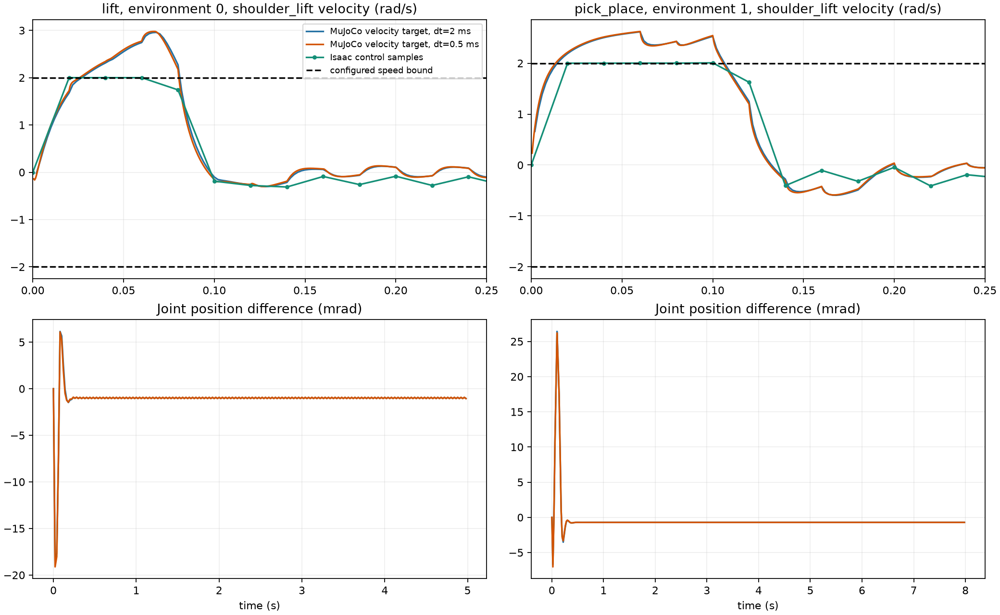
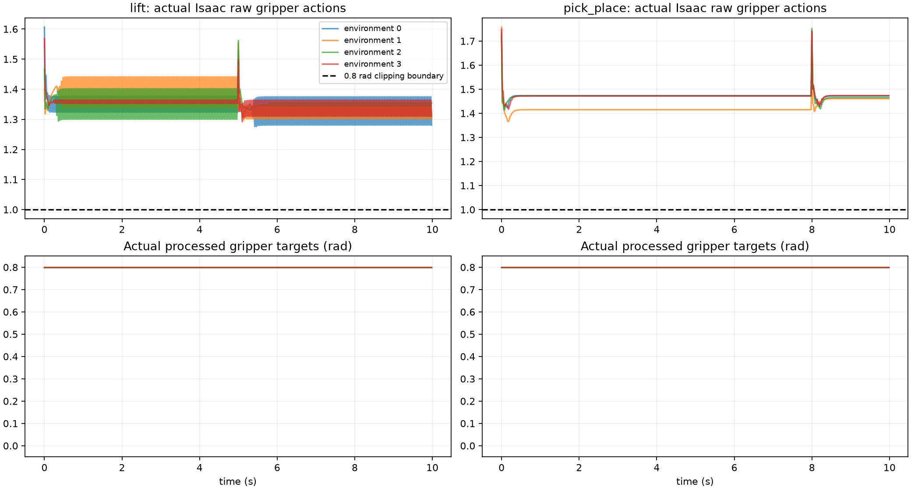

# SO-101 模型、控制与场景检查 · 2026-09-30

## 模型来源与关节坐标

Isaac 使用 Muammer Bay 与 Louis Le Lay 提供的第三方 USD；MuJoCo 使用 TheRobotStudio 的 `so101_old_calib.xml`。本轮核查官方 remote HEAD 为 `5f6d2b876a53a4872e405b991dd925556c9e38a4`，与本地资产版本一致。官方 [SO101 说明](https://raw.githubusercontent.com/TheRobotStudio/SO-ARM100/main/Simulation/SO101/README.md)规定 old calibration 的零位为水平伸展状态，new calibration 的零位为关节范围中点。当前转换包含 Pitch 的 `-π/2` 与 Elbow 的 `+π/2`。

两项实际 Isaac 记录各包含 2000 个关节状态；已有共同坐标 COM 与惯性检查覆盖各 14,000 个实体状态。主体 mesh 的顶点使用 USD transform、实际实体坐标转换与 MuJoCo 编译后的 mesh 坐标进行双向最近距离检查。六个活动实体的官方部件最大顶点距离低于 2.37 μm。官方 URDF 与 MJCF 的七个实体质量完全相同，COM 距离为零，完整惯性矩阵相对差异低于 `4.2e-15`。本轮没有发现关节顺序、零位转换、单位或主体 mesh 的错误。

第三方 USD 包含额外的 `gripper/collisions/camera_mount/Cube`，该部件参与碰撞；当前普通 MJCF 没有对应部件。USD 的 gripper 与 jaw 使用 SDF，其他实体使用合并 mesh 的 convex decomposition；MJCF 使用各部件的 convex mesh。USD 保留 base collider，当前 MJCF 没有 base collider。当前七个实体的质量沿用原始 CAD 数据，camera mount 没有单独定义质量。这些差异需要专门的接触与附加部件检查。

- [模型与主体 mesh 检查](model_audit.json)
- [实际物理参数的共同坐标检查](../physics_components/README.md)

## 固定基座与桌面

`jd_B300` 的实际 Isaac 检查包含四个克隆环境和 200 个物理步骤。机器人 root 相对环境原点的位置完全一致；运行期间最大位置变化为 `3.73e-8` m，quaternion 分量最大变化为 `1.79e-7`。这些测量范围内固定基座与克隆位置通过检查。

SeattleLabTable 的实际碰撞表面为 world z=-0.003 m。原生方块静止中心高度为 0.01199996 m，尺寸为 0.03 m。导出记录的 `table_geometry` 包含实际 box 的位置、quaternion、half size 和 collider 路径；`table_height_root=0.0270814472` m。任务判定使用独立的 `task_reference_height_root=0.0300814472` m。

MuJoCo 使用记录的有限 box。采用实际桌面几何的配对条件下，静止后的最大物体位置差异为 Lift 0.10920 mm、PickPlace 0.10957 mm；全部连续片段的最大差异为 1.46776 mm、1.49905 mm。名义桌面 plane 条件的最大差异均约为 2.891 mm。运动初期的接触响应仍有差异。

- [原生碰撞几何、材质、质量与基座检查](native_scene_report.json)
- [实际桌面几何的受控实验](measured_table_report.json)



## 驱动与速度限制

[PhysX Articulations 文档](https://nvidia-omniverse.github.io/PhysX/physx/5.3.0/docs/Articulations.html)说明，joint drive 使用隐式求解，位置与速度约束作用于时间步骤末端；`setMaxJointVelocity()` 通过关节力矩限制速度。当前 MuJoCo 的 velocity servo 根据位置误差生成速度目标，并使用有限 damping 施加力矩。速度目标上限与求解器中的实际速度约束具有不同的行为。

本轮使用实际动作、每环境 PD、质量、COM、完整惯性、重力、armature 和零关节摩擦。每项任务四个环境，八种条件，共 64 个环境片段、20,800 个控制步骤和 369,200 个物理步骤。额外的实际桌面条件包含八个环境片段、2600 个控制步骤和 26,000 个物理步骤。

| 条件 | Lift RMSE，rad | Lift 最大速度，rad/s | PickPlace RMSE，rad | PickPlace 最大速度，rad/s |
|---|---:|---:|---:|---:|
| velocity servo，10 ms | 0.012993 | 2.862474 | 0.001016 | 2.579163 |
| velocity servo，2 ms | 0.013670 | 2.957300 | 0.000981 | 2.615974 |
| velocity servo，1 ms | 0.013786 | 2.970041 | 0.000982 | 2.620863 |
| velocity servo，0.5 ms | 0.013858 | 2.976882 | 0.000983 | 2.623338 |
| position PD，2 ms | 0.022181 | 19.230066 | 0.010362 | 10.421611 |
| position PD，0.5 ms | 0.022041 | 19.388904 | 0.010227 | 10.372774 |
| velocity servo，关闭机器人接触 | 0.013670 | 2.957300 | 0.000981 | 2.615974 |
| velocity servo，力矩上限 3.35 N·m | 0.013670 | 2.957300 | 0.000981 | 2.615974 |

2 ms 的 velocity servo 条件中，机器人接触计数为零。关闭机器人碰撞，以及将 actuator 上限从 30 改为 3.35 N·m，均得到完全相同的关节位置、速度与力矩。最大 actuator 力矩为 Lift 2.66947 N·m、PickPlace 2.22278 N·m。速度最高值出现在初始 0.06–0.068 秒的 shoulder_lift。减小时间步长后，速度超限继续存在。

当前项目的 RL actuator 上限为 30 N·m；第三方 USD 与官方 URDF 的名义值为 10 N·m，官方 [MJCF motor 参数](https://raw.githubusercontent.com/TheRobotStudio/SO-ARM100/main/Simulation/SO101/joints_properties.xml)为 3.35 N·m、armature 0.028、frictionloss 0.052。实际 Isaac 记录的 armature 与关节摩擦系数均为零。官方 README 说明 motor 参数借用了 Open Duck Mini 的数据；这些参考参数没有完成本项目的电机测量校准。

- [驱动、时间步长、接触与力矩条件](dynamics_report.json)
- [实际数值与图表检查](visuals/visualization_report.json)



## 策略、动作转换与 reward

两项保存模型分别完成四环境、500 个控制步骤的实际 Isaac 推理，导出版本为 `cbe690a`。观测重建误差为零，策略输出误差低于 `8.4e-7`，动作目标转换误差低于 `3.0e-7`。新推理轨迹与已有轨迹的 SHA256 完全相同。

Lift 的 raw Jaw action 范围为 1.27608–1.60658，PickPlace 为 1.36604–1.75822。连续动作映射执行 `0.4 * action + 0.4` 并限制在 `[0, 0.8]` rad，因此本次全部 4000 个样本的夹爪目标均为 0.8 rad。双侧抓取接触样本为零；closure、grasp_hold、held_height、held_goal 和 success_bonus 的累计 reward 均为零。确定性保存策略尚未提供可用抓取行为。

这些记录可以检查开口状态下的运动与桌面响应，抓取接触和成功任务仍需要有闭合与持有动作的独立验收。当前 reward 的抓取判定使用 gripper 与 jaw 整个实体的物体接触力；fingertip 接触语义需要专门检查。

- [Lift Isaac 推理](lift_validation.json)与 [PickPlace Isaac 推理](pick_place_validation.json)
- [Lift portable metadata](lift_policy.json)与 [PickPlace portable metadata](pick_place_policy.json)



## 程序与复现

`rl export` 从原生 collision mesh 读取实际桌面几何，同时记录机器人 USD SHA256。`sim2sim compare` 保存 portable metadata SHA256 与 MuJoCo 桌面参数读取结果。`sim2sim mujoco` 恢复记录的物体初始线速度与角速度，并使用任务参考高度进行成功与终止判定。旧 portable metadata 使用其中明确记录的 plane；新导出包含实际 box。

```bash
OPENSO101_SKIP_ISAAC=1 TMPDIR="$PWD/outputs/tmp" PYTHONPATH=src \
  .venv/bin/python scripts/debug_so101_models.py \
  --output outputs/rl_progress/new_model_audit
OPENSO101_SKIP_ISAAC=1 TMPDIR="$PWD/outputs/tmp" PYTHONPATH=src \
  .venv/bin/python scripts/debug_so101_dynamics.py \
  --geometry-input outputs/rl_progress/lift_measured_table_policy.json \
  --output outputs/rl_progress/new_dynamics_debug
```

原生场景检查入口为 `scripts/debug_isaac_scene.py`。保存模型导出入口为 `scripts/run_scene_exports.py`；该入口检查正式 metadata 与 validation 文件后返回完成状态。44 项现有 CPU 回归检查通过，四项使用替代服务或对象的测试未执行。`scripts/check_so101_debug.py` 检查实际报告的来源、模型单位、惯性、基座、桌面参数读取、源轨迹 SHA256、策略推理与图表文件。

Linux MuJoCo 的相同动作比较使用全部实际实体参数、PD、重力、armature 与关节摩擦；最大关节误差为 Lift 0.050743 rad、PickPlace 0.026419 rad。策略反馈评估使用报告中明确标记的名义 position PD 与上游 inertia、frictionloss，两项各四个 episode，成功率均为零。该反馈评估没有完成源实际物理参数与 solver 速度约束的复现。

- [正式检查](check_report.json)
- [Lift 相同动作比较](lift_compared.json)与 [PickPlace 相同动作比较](pick_place_compared.json)
- [Lift 策略反馈评估](lift_evaluated.json)与 [PickPlace 策略反馈评估](pick_place_evaluated.json)

RL 训练持续停止，真机工作暂缓；solver 速度约束、抓取接触与成功策略迁移继续保持独立验收范围。
