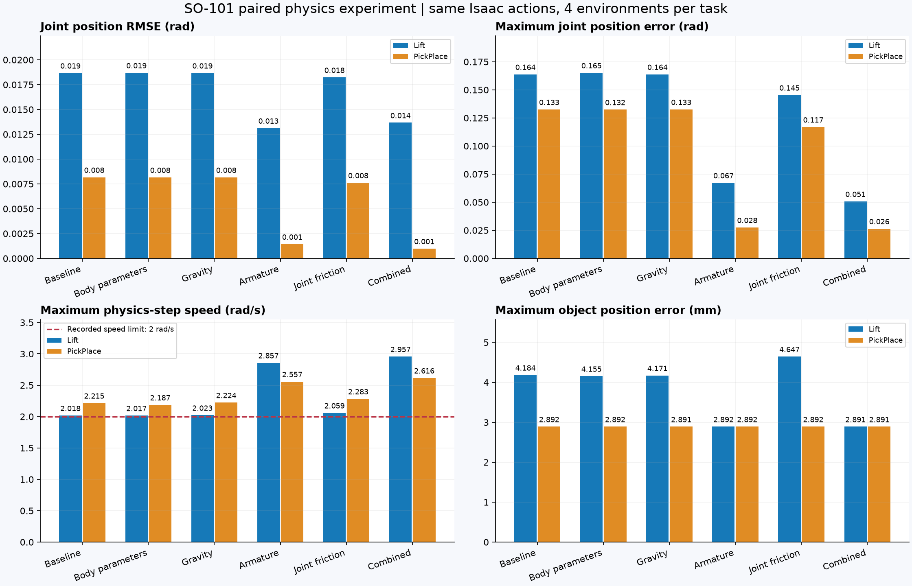
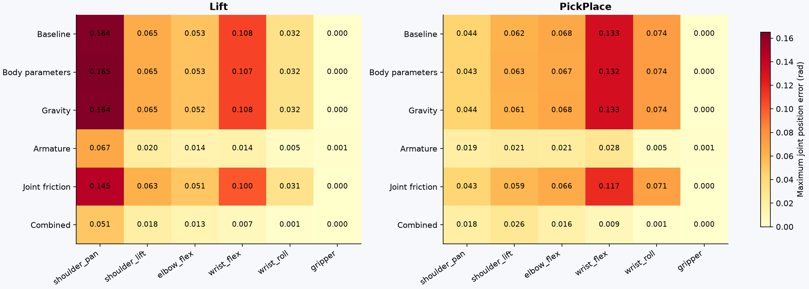
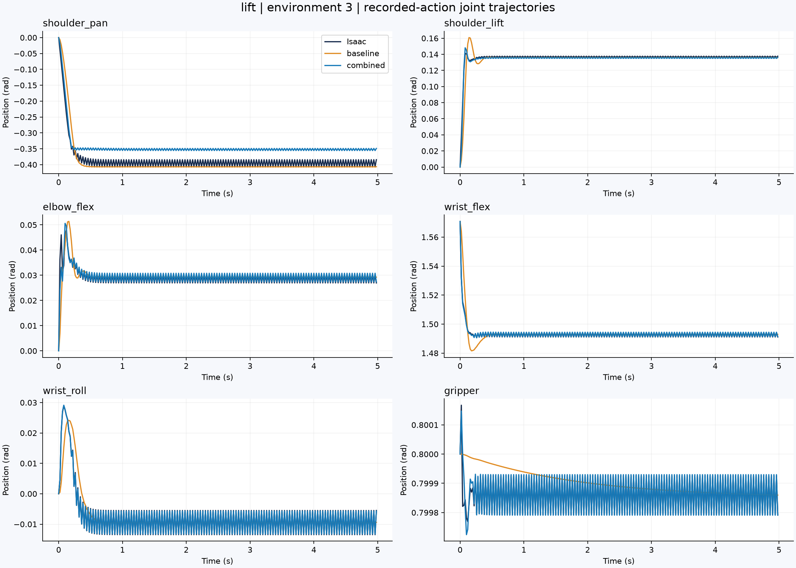
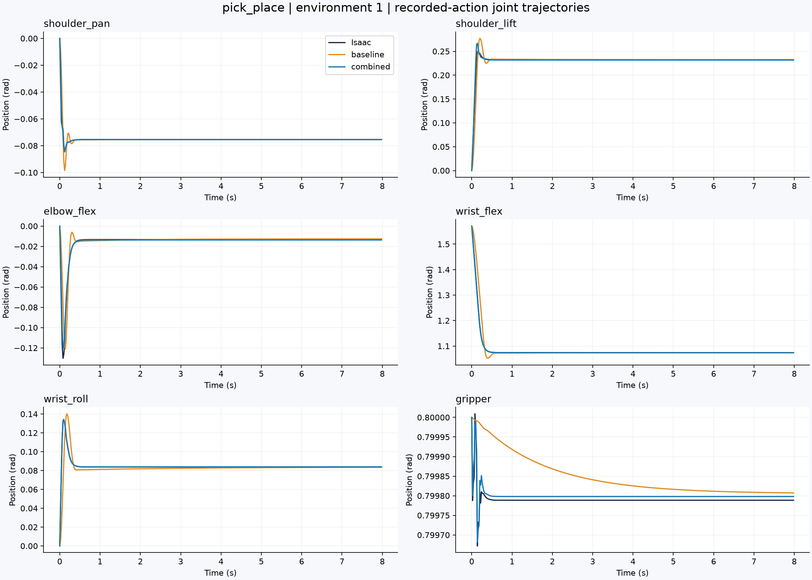
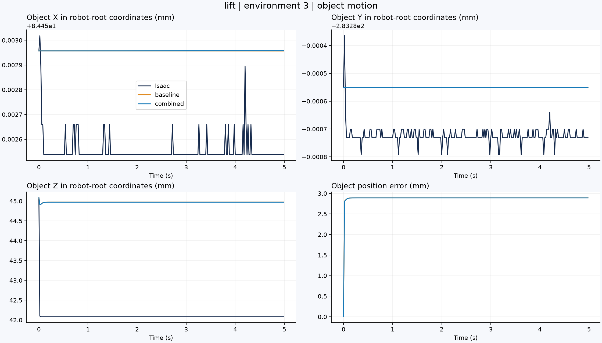
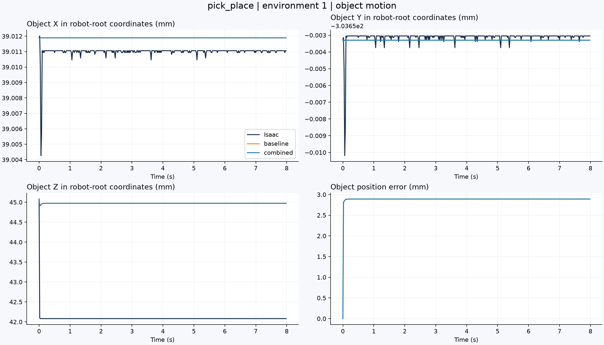

# MuJoCo 实际参数配对实验 · 2026-09-30

代码版本为 `3f0493c`，运行使用本地 MuJoCo 3.14.0 和来自 `jd_B300` 的实际 Isaac 动作记录。RL 训练保持停止，真机工作暂缓，定时任务已删除。本次目标完成后开发停止。

## 输入与检查范围

Lift 与 PickPlace 各比较四个环境。每项使用六种参数组合：Baseline、实际实体参数、实际重力、实际 armature、实际零关节摩擦，以及四项组合。全部条件使用相同初始状态、关节目标、实际 PD、受限速度目标驱动和模型。控制周期为 0.02 秒，MuJoCo 物理周期为 0.002 秒。源 episode 终止时结束比较；Lift 每环境 250 步，PickPlace 每环境 400 步，共 48 个连续环境片段、15,600 个控制步骤和 156,000 个物理步骤。

实际实体参数包含机器人七个实体和任务物体的质量、COM 与完整惯性矩阵。固定的实体坐标转换使用第一帧实际姿态计算，随后在每个源关节状态检查共同坐标中的 COM 与惯性。输入矩阵检查对称性后取对称部分，使用主惯性矩和右手坐标 quaternion 写入 MuJoCo。Baseline 也执行相同的模型常数更新与参数读取过程。

关节摩擦条件要求源系数为零；对应 MuJoCo `frictionloss=0`。非零系数与力矩单位的转换需要独立验证。静态／动态接触摩擦、碰撞几何和 solver 速度约束保持独立验收范围。

- Lift 源轨迹 SHA256：`845ea060c31db5432f483e16a3b03ced7fc1658717fc5aacb36b973a80a8bd52`。
- PickPlace 源轨迹 SHA256：`398a9cb0a580c165105780f9e06ddad9a4744094f4aab82d0f54b6cccde84632`。
- [配对检查报告](physics_components_paired_report.json)：相同输入、未修改参数、实际参数读取、运行关节位置与速度保持、共同坐标 COM／惯性和原生力矩公式均通过。
- [输入拒绝报告](physics_component_inputs_report.json)：已有输出、重复参数和缺少实体字段的实际旧轨迹均在创建输出前终止。
- 现有 44 项 CPU 检查通过，四项含替代服务或对象的测试未执行。

共同坐标 COM 最大差异为 Lift 1.008 μm、PickPlace 0.728 μm，惯性最大相对差异分别为 `2.50e-6`、`1.78e-6`；原生 actuator 力矩公式最大差异低于 `4.5e-16` N·m。

## 关节与物体差异

RMSE 汇集四个环境的全部控制采样和六个关节。最大速度来自每个物理步骤；其余最大误差来自控制步骤之前的状态。

| 参数组合 | Lift RMSE，rad | Lift 最大关节误差，rad | Lift 最大速度，rad/s | PickPlace RMSE，rad | PickPlace 最大关节误差，rad | PickPlace 最大速度，rad/s |
|---|---:|---:|---:|---:|---:|---:|
| Baseline | 0.018670 | 0.163835 | 2.017629 | 0.008171 | 0.132604 | 2.215268 |
| 实际实体参数 | 0.018694 | 0.165194 | 2.016633 | 0.008163 | 0.132454 | 2.186767 |
| 实际重力 | 0.018673 | 0.163836 | 2.022593 | 0.008166 | 0.132618 | 2.224270 |
| 实际 armature | 0.013121 | 0.067301 | 2.857198 | 0.001432 | 0.027560 | 2.557485 |
| 实际零关节摩擦 | 0.018233 | 0.145385 | 2.058973 | 0.007620 | 0.116931 | 2.282747 |
| 全部组合 | 0.013670 | 0.050743 | 2.957300 | 0.000981 | 0.026419 | 2.615974 |

当前记录中，单独修改 armature 对关节误差的影响最明显。全部参数组合的最大关节误差减少，但实际速度超过 2 rad/s 的幅度增加。实体参数与重力对本次关节误差的影响较小。

全部组合的最大物体位置差异为 Lift 2.891 mm、PickPlace 2.891 mm；对应 Baseline 为 4.184 mm、2.892 mm。这些数据覆盖已记录动作和初始场景，报告保持 `physics_equivalence_verified=false` 与 `task_success_verified=false`。

## 图表

本地交互页面保存在仓库的 `outputs/rl_progress/physics_components_visuals/physics_explorer.html`，`jd_B300` 的独立运行页面位于 `outputs/rl_progress/physics_components_linux_visuals/physics_explorer.html`。页面包含八个任务／环境选项、184 条实际数据曲线，支持时间缩放和曲线选择。静态图及其 SHA256 见 [可视化报告](visuals/visualization_report.json)。关节与物体曲线展示 Combined 最大关节误差所在的环境，环境编号保存在图标题。













## 复现与后续目标

在已有实际源记录和官方机器人模型的仓库目录执行，使用新的 run-id 与输出路径：

```bash
.venv/bin/python scripts/run_physics_components.py --run-id new_run
OPENSO101_SKIP_ISAAC=1 PYTHONPATH=src TMPDIR="$PWD/outputs/tmp" \
  .venv/bin/python scripts/check_physics_components.py --run-id new_run \
  --output outputs/rl_progress/new_run_report.json
OPENSO101_SKIP_ISAAC=1 PYTHONPATH=src TMPDIR="$PWD/outputs/tmp" \
  .venv/bin/python scripts/visualize_physics_components.py --run-id new_run \
  --summary outputs/rl_progress/new_run_report.json \
  --output outputs/rl_progress/new_run_visuals
```

图表使用 Plotly 和 Matplotlib。独立 CPU 环境的依赖保存于 `requirements-mujoco.txt`；`jd_B300` 使用 `/home/jixin/workspace/envs/openso101-mujoco`，环境依赖检查通过。

`jd_B300` 使用相同 Isaac 源记录和代码独立完成六种条件及全部读取检查，共计另外 48 个环境片段。原始 HDF5 与日志在本地使用 `*_physics_components_paired_*`，远程使用 `*_physics_components_linux_verified_*`，均保存在 `outputs/rl_progress/`。源模型继续保留。本目录保存十二份本地独立条件报告、Linux 复现汇总与检查结果。

- [Linux 配对检查](physics_components_linux_report.json)
- [两台主机的来源、数量与指标比较](physics_hosts_report.json)：最大关节误差指标差异为 `2.23e-16` rad，最大速度指标差异为 `4.45e-16` rad/s。
- [Linux 图表检查](linux_visualization_report.json)

后续目标为使用上述实际参数，测量两个模拟器的 solver 速度约束和接触响应。RL 训练继续保持停止；成功策略迁移和真机任务仍待验收。
