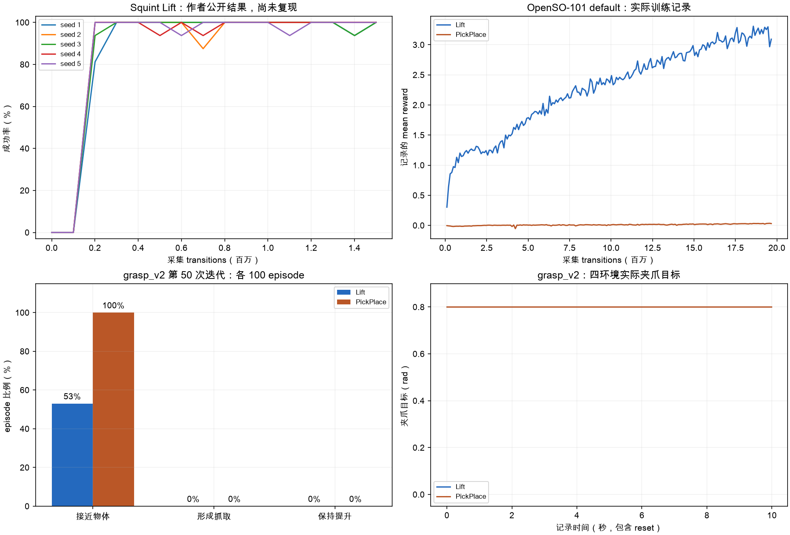

# Squint 源码与已保存训练记录核查

## 实际输入

- Squint 版本：`7086fd516eda7df585a5261c541e0670a6d916b4`。
- 作者公开 Lift CSV：五个 seed，仅选择 `algorithm=Squint`、`task=SO101LiftCube-v1`。作者结果尚未独立复现。
- OpenSO-101 default：Lift、PickPlace 各 200 次迭代的实际 TensorBoard scalar，以及实际 `train.json`。
- OpenSO-101 grasp_v2：第 50 次迭代 snapshot 的原生 `backend.json`，从 `jd_B300` 获取；每项 100 episode 独立评估；每项四环境、500 步的原生 Isaac 推理轨迹与导出 metadata。

全部输入 SHA256、原生配置、实际统计和脚本 SHA256 保存在 [report.json](report.json)。本次没有执行训练、修改模型或恢复 optimizer。

## 检查结果

每项 default scalar 均有 200 个有限值。grasp_v2 的模型 SHA256 与独立评估一致，100 episode 的实际成功率与报告一致。原生 HDF5 的 SHA256 与原验证报告一致；夹爪映射的最大误差小于 `1e-6` rad；各项实际 reward 与原验证报告通过数值一致性检查。

Lift 夹爪原始输出范围为 1.27608–1.60658，PickPlace 为 1.36604–1.75822，两项的 2000 个环境步骤全部进入打开目标裁剪区域。夹爪目标全部为 0.8 rad，双侧抓取接触为零。100-episode 独立评估中的抓取和任务成功也均为零。

四幅图分别表示作者公开结果、本项目 default reward 记录、本项目 grasp_v2 的阶段评估和实际夹爪目标。各部分使用自身任务标准及来源，图中曲线仅展示已有记录。



## 重新执行

准备完整 Squint 源码、原生 snapshot 的两个 `backend.json`，以及已有 portable HDF5 后，执行只读取记录的脚本：

```bash
.venv/bin/python scripts/audit_squint_training.py \
  --squint outputs/research/squint \
  --backend-dir outputs/research \
  --font '/System/Library/Fonts/Supplemental/Arial Unicode.ttf' \
  --output outputs/rl_progress/squint_training_audit
```

`--backend-dir` 中的文件名称为 `lift_grasp_v2_backend.json` 与 `pick_place_grasp_v2_backend.json`。`--font` 接收当前主机的中文字体文件。输出目录需要尚未存在；输入缺失、SHA256 不一致、记录数量或数值异常立即终止。

采纳条件见 [训练设计文档](../../../guides/squint-training-review.md)。训练与任务收敛尚未完成验收。
