# RL 与场景服务运行检查

## 来源

原生物理检查来自固定提交 `5b46a2f`，物理周期为 0.001 秒，控制周期为 0.02 秒。每种条件包含四个真实 Isaac 环境、500 个控制步骤，共 40,000 个物理步骤；速度直接记录自 PhysX 每个物理步骤。完整报告位于 `native_default_order/`。

| 任务与条件 | 物理采样最高速度 rad/s | 目标转换最大误差 rad | 速度检查 |
|---|---:|---:|---|
| Lift nominal | 1.157624 | 0 | 通过 |
| PickPlace nominal | 1.714590 | 0 | 通过 |
| Lift randomized | 1.552026 | 0 | 通过 |
| PickPlace randomized | 1.727205 | 0 | 通过 |

完整 episode 的折扣 shaping 累计绝对值均低于 `5e-7`。检查报告保留实际 trace 和源码 SHA256。以上记录证明报告中的采样范围；任务成功未通过。`native/` 保留各自环境参数下的独立原始记录。

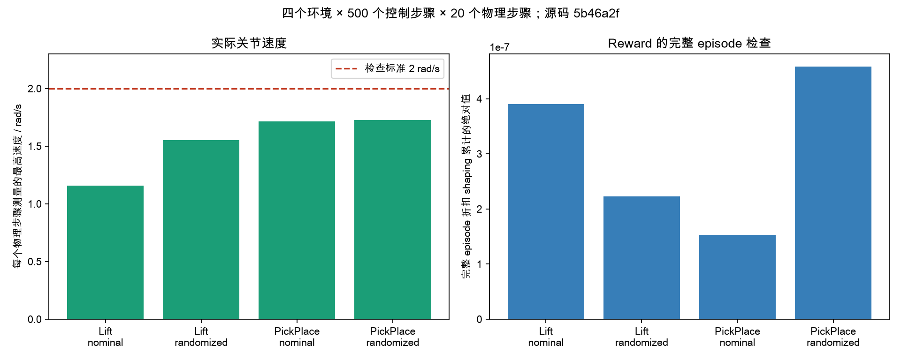

## 训练、导出与 MuJoCo

训练来源为 `85af781`：Lift、32 个环境、两次 PPO 更新，共 6,144 transitions。独立评估使用 seed `10042`，100 episodes 的成功率为零，接近率为 19%，抓取与持续提升率为零。完整逐 episode 数据保存在 `evaluation_history.json`。

checkpoint SHA256 为 `fa287ff2614db8f93e9867ab9b491a799070a46175ec5120582a3adb4249f365`。导出的策略在四个原生 Isaac 环境执行 300 步，观测重建误差为零，actor 和目标转换最大误差均为 `1.1920928955e-7`。

同一策略使用官方 `so101_old_calib.xml`、实际源环境物理参数、CoACD 夹爪碰撞和 OSQP 受限 implicit PD，在 MuJoCo 3.14.0 执行四个 episode，共 10,000 个物理步骤。实际速度与力矩检查通过，成功率为零。1,200 个末端坐标的最大位置误差为 `1.9275e-6` m，最大旋转误差为 `1.0678e-5` rad。策略与 source trace SHA256、实体参数和每个 episode 的检查结果保存在 `mujoco_report.json`。

`8965174` 的固定 learning rate 检查包含 6,144 transitions 和 40 次梯度更新，actual learning rate 均为 `0.0001`。每次更新的 checkpoint 保存完成；100 episodes 独立评估为 `0/100`，接近物体比例为 17%，完整记录位于 `checked_ppo_evaluation.json`。`5e257c3` 的持续进展奖励训练运行于独立目录，原始模型和记录全部保留。

`training_scalars_32b58c6.json` 保存实际 TensorBoard 数值与已有 checkpoint 的参数有限性检查。图表直接使用原始数值，并通过 SHA256 关联文件。

`baseline_100_iterations.json` 保存 `8965174` 的 100 iterations 独立评估。训练完成 19,660,800 transitions，评估 seed 为 `10042`，100 episodes 中接近物体 96 次、双侧接触 28 次、持物抬升 1 次、任务成功 0 次。对应模型 SHA256 为 `4a9544b269e9b3cc37434d17b555c18ff0e7bd643c8a671786accc82d98cf89a`。

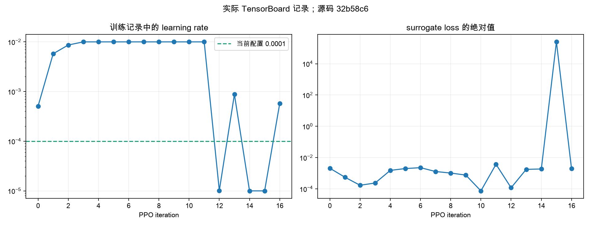

## 模型服务

`gpt-6-astra` 的真实 Responses 请求经过完整 SSE 完成事件和 Pydantic schema 检查，保留输入任务与释放要求。请求用量为 153 input tokens、46 output tokens，共 199 tokens。请求和响应 SHA256 保存于 `model_completion.json`，记录不包含密钥。预算按实际 HTTP 请求次数计算。

CPU 检查为 44 项通过，四项使用替代服务或对象的测试未执行。

## TaskIntent、TaskProgram 与资产

`scenes/typed_intent_job.json` 保存真实 Astra 的两次请求，共 6,806 tokens、22.062 秒。TaskIntent 版本 2 保存完整文本、尺寸、初始 Pose 和最终目标。所用资产 UID 为 `811698689ddf00274a8abce36f4e159a`，来源为 `generated://trimesh/recipe`。场景 SHA256 为 `f8b5e582908483dbb33df65172903912eb751f426e4a582f4047d3285bb0a6a0`，TaskProgram SHA256 为 `9d7f6e141d7147069ff54e632e2b2ddb1b53f683be4514da4117cb3122e1684c`。该记录完成数值参数、条件、文件内容与静态布局检查，外观匹配和任务成功需要独立验收。

`scenes/program_runtime.json` 保存四环境、100 次 reset、200 步的实际 TaskProgram 检查。CPU 与 Isaac 检查器逐步读取相同的实体状态与双侧接触力，共 800 次结果比较，每台相机检查 800 帧。观测到的最大阶段为 0，双侧接触次数为 0，任务成功次数为 0。完整 HDF5 轨迹通过报告中的 SHA256 关联。

资产 embedding 的独立检查使用 Objaverse Apple `4c19ae47dbe8468285ee53ff487fe51a`，资产 SHA256 为 `709a61d29096e6d68730b9debc30c6816caf9b31315c1186017bd121814557f2`。模型为 `sentence-transformers/all-MiniLM-L6-v2`，固定 commit `1110a243fdf4706b3f48f1d95db1a4f5529b4d41`，384 维 normalized embedding；`red apple` 的 cosine similarity 为 `0.787699`。当前检查覆盖单个实际资产。

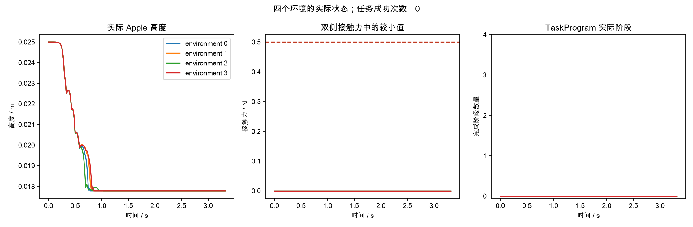

## 实际索引资产的完整场景

`indexed_scene/job.json` 记录真实模型的两次请求，以及实际 Apple 资产的检索、选择和场景生成。查询为 `apple fruit`，cosine similarity 为 `0.709894`；使用资产 `4c19ae47dbe8468285ee53ff487fe51a`，文件 SHA256 为 `709a61d29096e6d68730b9debc30c6816caf9b31315c1186017bd121814557f2`。场景 SHA256 为 `5e6e98ed5a21caaac57e87e3c4c97a9d4108d65581e581c0fcecbdbde7a1239e`。完整来源、TaskIntent、TaskProgram 和资产保存在版本化 bundle。

`indexed_scene/runtime.json` 记录该 bundle 的真实 Isaac 运行，包含四个环境、100 次 reset、200 个控制步骤、每台相机 800 帧和 800 次 CPU 与 Isaac TaskProgram 比较。最大任务阶段为 0，双侧接触次数为 0，任务成功尚未通过。

## 抓取控制与接触检查

`grasp_control/report.json` 来自 `056fd18` 的原生实际 reset。四环境各执行 250 控制步骤，成功率为 `0/4`，最高物理采样速度为 `1.497725 rad/s`。逐步骤记录包含真实关节位置、位置目标、重力保持力矩、夹爪接触力、物体位置和任务阶段。

`grasp_control/geometry_contacts.json` 使用相同实际姿态、官方 MJCF、SHA256 校验的 CoACD gripper 与实际桌面几何进行接触检查。一个规划姿态需要 `0.795480 N·m` 的保持力矩，measured-reference 控制的静止力矩范围为 `0.712 N·m`。四个倾斜抓取姿态均与桌面发生交叉。MuJoCo 几何结果单独记录验证范围，原生任务成功尚未通过。

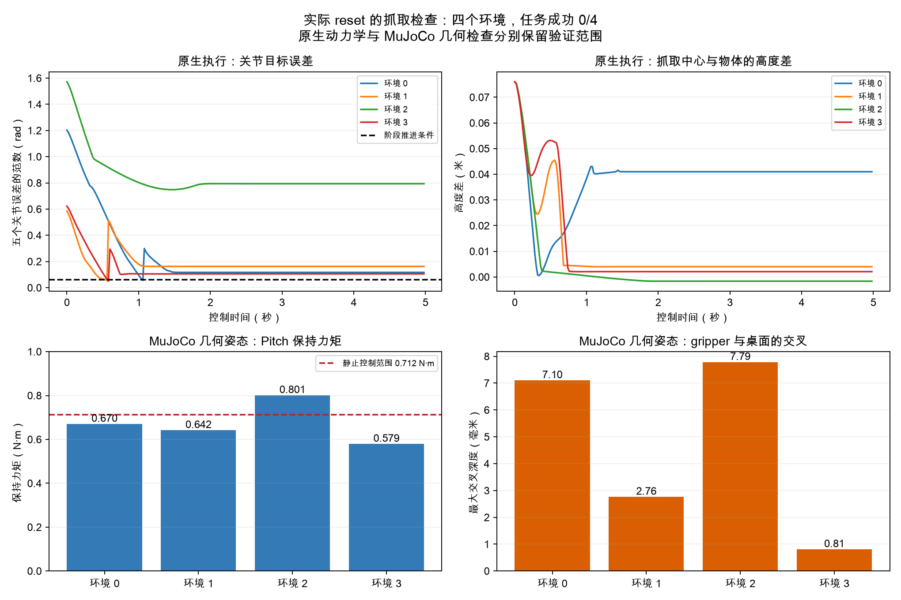
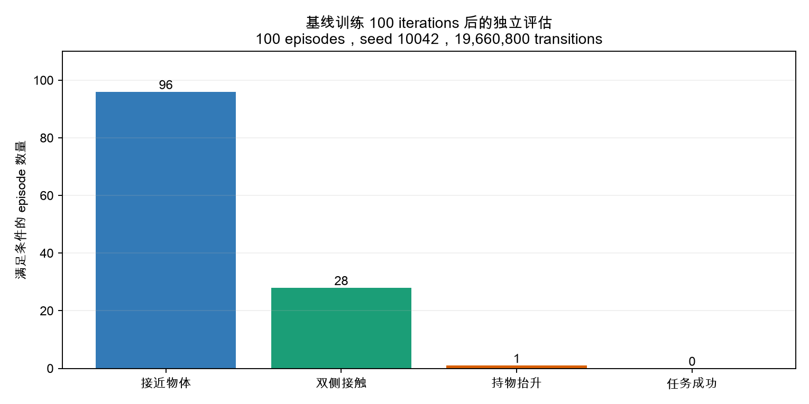

## 视觉 student 的实际数据

`student/recorded_inference.json` 使用实际完成蒸馏的视觉 student，模型 SHA256 为 `6d1df1cd1feaf96ad7da8ac41c8e17f591b7d84e141c92195f4c3b854050ba85`。原生独立评估完成 `0/8`，并采集第一条完整 250 帧 HDF5。逐帧推理读取实际双相机、关节和任务目标，生成有限且形状正确的 motor commands；控制周期为 `0.02 秒`。episode SHA256 为 `9088da28fcc173fef846c137c7e495e00e315cd11fa0dd3d609c810fd1bd2dbd`。真机运行尚未执行。

## 绝对位置控制

`native_position_control/` 保存 `3f82f0a` 的四种原生物理条件，以及 `9e35e9b` 的脚本 Lift 与 PPO 独立评估。动作均值根据原生初始关节位置与实际 action mapping 初始化，控制目标覆盖官方完整关节范围。

| 任务与条件 | 逐物理步骤最高速度 rad/s | 目标转换最大误差 rad |
|---|---:|---:|
| Lift nominal | 1.500007033 | 0 |
| Lift randomized | 1.500007629 | 0 |
| PickPlace nominal | 1.500007510 | 0 |
| PickPlace randomized | 1.500028849 | 0 |

每项包含四环境、500 控制步骤，四项共 40,000 个物理步骤。速度检查和完整 episode reward 检查全部通过。

`task.json` 记录实际标准 reset 下的 IK 控制结果：成功 `1/4`，成功环境有 22 个双侧接触步骤，物体中心最高为 robot root frame 的 `0.204055 m`。控制包含原生重力补偿，最高实际速度为 `1.500087 rad/s`。原生轨迹 SHA256 为 `5441908768bdae4ba3d117c6a397a1609eb9c319423d08dd318190b65c2b3588`。脚本控制与 RL 策略分别保留任务验收状态。

`ppo_evaluation.json` 保存 6,144 transitions 后的 100 episodes 独立评估，成功率为 `0/100`，接近物体比例为 8%。`activity_100_iterations.json` 保存增量控制进展奖励配置在 19,660,800 transitions 后的实际评估：接近物体 98 次、双侧接触 39 次、提升与成功次数均为零。

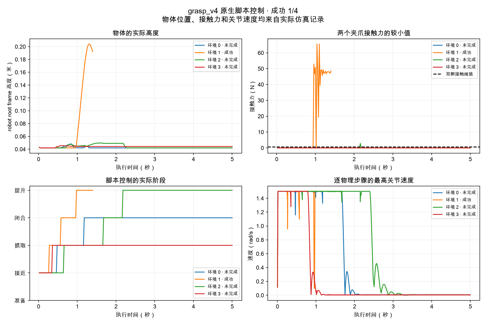
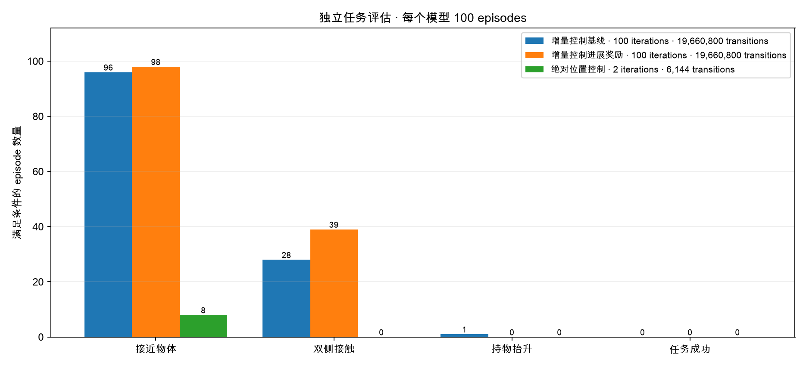

## 连续路径、夹爪探索与视觉随机化

`native_position_control/cartesian_task.json` 记录 `a03a526` 的四个实际 reset，原生成功为 `0/4`。两个环境达到提升阶段，一个环境的物体中心最高为 robot root frame 的 `0.138460 m`。全部路径、实际位置、接触力与逐物理步骤速度通过报告中的轨迹 SHA256 关联。

两个增量控制配置完成 200 次更新、39,321,600 transitions 后，各自的 100 episodes 独立评估中接近物体比例为 100%，双侧接触比例为 28% 与 32%，持物抬升与成功均为零。`neutral_jaw_evaluation.json` 对应 6,144 transitions 的完整范围位置控制检查，接近物体 7 次，任务成功为零。

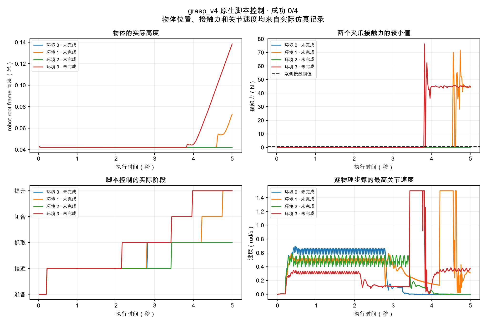
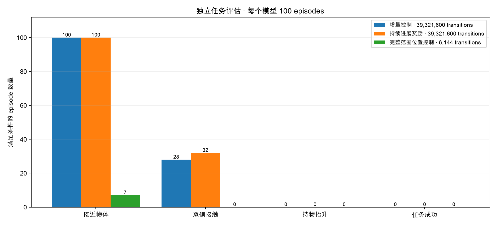

`camera_collision_geometry.json` 使用实际 USD 的 164 个 camera mount 顶点与 216 个多边形，生成 65 个 MuJoCo convex parts；机器人质量、COM 和惯性保持一致。记录保留原生 SDF 与 MuJoCo CoACD 的各自来源，物理等同性尚未确认。

`visual_randomization.json` 记录四环境、三次 reset、每次十个控制步骤。照明强度与颜色、物体颜色和两个 128×128 RGB 相机的实际输出均发生变化，nominal 质量与 stiffness 保持一致。该记录证明请求的视觉随机化确实执行，任务成功尚未通过。

`portable.json` 与 `mujoco.json` 使用同一个完整范围位置策略。原生观测重建误差为零，策略最大误差为 `5.96e-8`，位置目标最大误差为 `1.19e-7`。MuJoCo 完成四个 episode、20,000 个物理步骤，实际速度与力矩检查通过，任务成功为 `0/4`。

`neutral_jaw_exploration.json` 使用最终模型和 1,200 个实际原生状态。确定性 jaw 目标为 0.401250–0.404060 rad，小于 0.4 rad 与 0.2 rad 目标的条件概率为 49.65% 与 24.31%。模型 SHA256 为 `5d7510ffc0e1136f814467bc030692970903896d311b2c5cb383453e4ff6ddf8`，参数与独立评估模型逐项一致。

`neutral_jaw_portable.json` 与 `camera_mujoco.json` 保存同一最终模型的导出和 MuJoCo 检查。MuJoCo 包含原生 camera mount 的 48 个 CoACD convex parts，各自独立设置四个实际初始环境；共 20,000 个物理步骤，速度与力矩检查通过，任务成功为 `0/4`。末端坐标最大位置误差为 `1.929104 µm`，最大旋转误差为 `1.09035e-5 rad`。

`checkpoint_selection.json` 使用 `5ec65c2` 的原生环境完成四次更新、1,536 transitions。训练日志成功率为零；依据训练日志成功率和 reward 选择的文件分别保存，全部参数为有效数值。报告包含文件、检查脚本与 runner 的 SHA256，独立任务成功尚未通过。

## 完整闭环的任务验收

`validation_loop/report.json` 来自真实 teacher 模型的独立 100 episodes 检查，seed 为 `30042`，模型 SHA256 为 `863e4671996ae4e4294eea419461f905fbd60a9690eedf38482e00227eb525af`。实际成功率为 `0/100`，状态为 `task_threshold_not_met`。teacher、MuJoCo 与 student 的各项任务评估均要求至少 `90/100`；成功策略的完整流程尚未通过。

## 原生连续抓取与双相机

`native_position_control/timed_native_lift.json` 保存 `5ec65c2` 的四个实际初始场景。原生任务成功为 `4/4`，成功步骤分别为 243、190、227、180；双侧接触步骤分别为 85、78、67、78。最高逐物理步骤速度为 `1.500002 rad/s`，重力保持力矩最大为 `0.806935 N·m`。实际接触记录中，两侧 jaw 的 net force 与 object filtered force 一致。

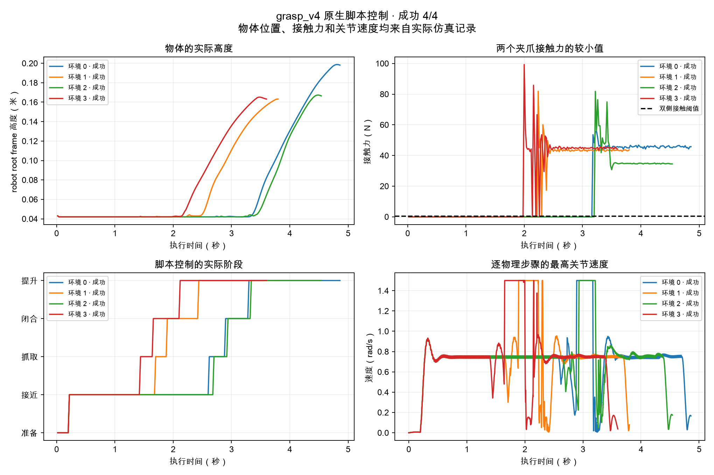

`native_position_control/dual_camera_lift.json` 保存 `4ec9f84` 的独立运行，原生任务成功为 `4/4`。实际 overhead 与 wrist 相机生成 243 帧、50 fps、512×256 MP4，视频 SHA256 为 `0d02d60675d78e4be077f43cc2d70d4a84dd9a8ad910370bc87e44a7f4a2317f`。HDF5、视频与逐步骤状态保存在 `outputs/rl_progress/v4_video_4ec9f84_task/`。脚本控制成功与 RL 策略成功分别记录。

## Gaussian latent PPO

rollout 保存实际采样的 Gaussian latent，环境使用 Tanh 动作。log probability 使用 float64；每次更新前读取保存的 latent、mean 与 std，独立重建 Gaussian 概率。`latent_ppo/native_rollouts.jsonl` 中两轮各 3,072 transitions 的最大重建误差均为零。

`latent_ppo/native_evaluation.json` 保存 `f5d5146` 完成 6,144 transitions、40 次梯度更新后的实际 100 episodes 独立评估，成功率为 `0/100`，接近物体比例为 7%。模型 SHA256 为 `eb532fc2c7e0637fdec61e0e9db153d3a4ed1363fd2d1303dde0e3baf1d5655e`。

`latent_ppo/saved_rollout_precision.json` 使用保存的 196,608 transitions、实际模型与优势值，在 CPU 上计算 likelihood 和 loss gradient。原始状态 SHA256 为 `94ebfcd0c30f61b41c7a98c5a79d78927700d2d0ea9239addf68b73a65809980`。float64 ratio 与 surrogate gradient 的全部数值有效；完整状态文件保留于 `outputs/rl_progress/v3_activity_numerical_failure/`。

## 多 backend 的实际初始化

`backend_checks/` 保存 `57b3874` 的六项独立运行。每项执行 256 transitions，随后保存、加载模型并完成四个独立 episodes。请求初始 std 为 0.73，实际值全部为 `0.730000019`。这些记录验证配置与程序执行，完整学习比较需要相同任务条件的训练与评估。

| Backend | Algorithm | transitions | 独立成功 |
|---|---|---:|---:|
| rsl_rl | PPO | 256 | 0/4 |
| SB3 | PPO | 256 | 0/4 |
| skrl | PPO | 256 | 0/4 |
| rl_games | PPO | 256 | 0/4 |
| SB3 | SAC | 256 | 0/4 |
| SB3 | TQC | 256 | 0/4 |

## grasp_v4 的多 backend 训练

`backend_comparison/` 保存 RSL PPO、SB3 PPO、skrl PPO 和 rl_games PPO。每项使用 nominal Lift、seed 42、32 个环境、32 个 rollout 步骤、初始 std 0.73、hidden dimensions `[32, 16]` 和 50 次更新，共 51,200 transitions。每项完成模型保存、加载及 seed 10042 的 100 episodes 独立评估，任务成功均为 `0/100`。RSL 使用 Tanh Gaussian 和原生初始姿态动作均值，其余 PPO 使用各自框架的 Gaussian 策略。SB3 SAC 与 TQC 在相同 `grasp_v4` 任务中各完成 256 transitions、模型保存加载与四个独立 episodes，成功均为 `0/4`。

`backend_curves/report.json` 保存四项实际 TensorBoard 事件文件、模型、评估的 SHA256 与每个实际日志点。每个框架保留其日志单位与 episode 平均窗口，全部预算为 51,200 transitions。图表的日志窗口和横坐标各自注明。独立评估比较同一任务条件，记录如下。

| Backend | 接近物体 | 双侧接触 | 持物抬升 | 任务成功 |
|---|---:|---:|---:|---:|
| RSL PPO | 35/100 | 0/100 | 0/100 | 0/100 |
| SB3 PPO | 7/100 | 0/100 | 0/100 | 0/100 |
| skrl PPO | 27/100 | 2/100 | 0/100 | 0/100 |
| rl_games PPO | 35/100 | 1/100 | 0/100 | 0/100 |

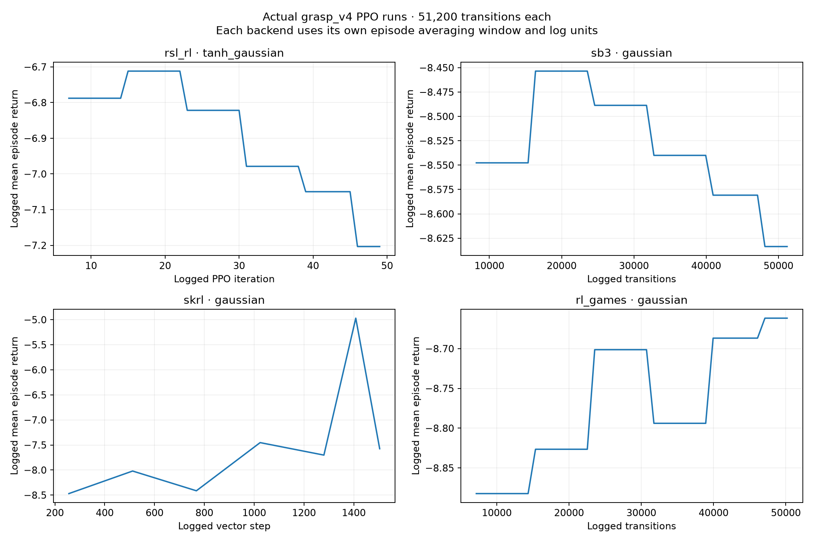
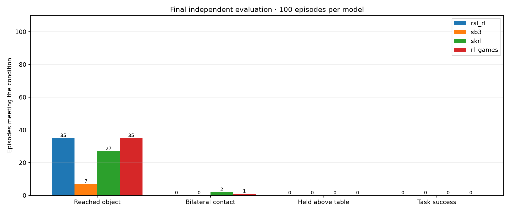

## 原生动作的 MuJoCo 回放

`native_replay/native.json` 保存 `e745001` 的原生脚本 Lift `4/4`，以及路径执行前实际关节与物体位置、速度、机器人质量、完整惯性、COM、重力、armature、关节摩擦、PD 和速度限制。初始物理文件 SHA256 为 `cebef4d42da9d0357e094463c7956501cc9ab15efb66f50264be634a27da359e`。

`native_replay/mujoco.json` 使用这些初始状态和实际原生 joint targets，在 MuJoCo 中执行四条连续轨迹，共 800 个控制步骤、16,000 个物理步骤。实际速度和力矩限制全部通过，质量、COM 和完整惯性读回检查通过。手臂关节 RMSE 为 `0.0005–0.0032 rad`，jaw RMSE 为 `0.09–0.20 rad`，MuJoCo 任务成功为 `0/4`。

`native_replay/diagnostics.json` 依据相同的高度、目标距离、双侧接触和连续保持条件检查两种模拟器的逐步状态。MuJoCo 环境 0、2 丢失物体；环境 1、3 保持双侧接触，连续符合成功条件的时间为 0.16 秒、0.22 秒。任务要求为 0.25 秒。回放在各自原生成功步骤结束，全部 joint targets 保持源值。接触等价与成功迁移仍需验证。

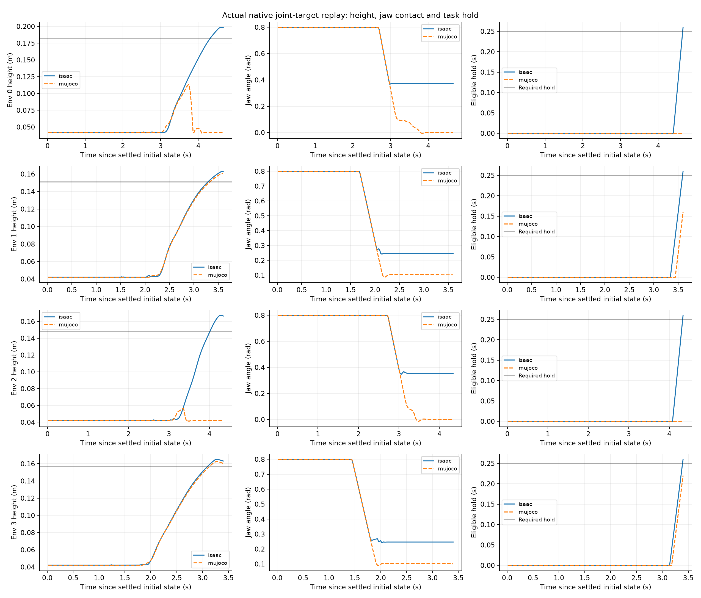

## 训练停止与模型保存

`training_stop/report.json` 保存 `2f0e735` 的实际原生训练检查。训练进程收到 SIGTERM 后于 `1.716817 秒`退出，保存明确的 `training_stop.json`，包含 signal、实际 PID 和源提交。Isaac framework 的退出码为零，训练状态为 `stop_requested`，没有完成训练的 metadata。全部原始模型继续保存，已经保存的 256 transitions 模型和 SHA256 保持一致。该检查使用独立的四环境训练进程，完整 campaign 继续运行。

## 实际实体运动与夹爪接触表面

`native_body_checks/native.json` 保存 `f1cdd56` 的原生 Lift `4/4`，包含七个机器人实体的实际位置和 quaternion。`kinematics.json` 在 800 个实际控制步骤中使用官方 MJCF 计算相同关节姿态，共 5,600 次比较。每个实体只使用其实际初始姿态确定一次坐标变换。两个夹爪的最大位置差为 `3.677386 µm`，最大旋转差为 `1.625966e-5 rad`。

`contact_geometry.json` 读取 36 个实际双侧接触步骤的关节与物体姿态，在相同几何状态下计算 CoACD 夹爪与物体的 signed surface distance，测量范围约为 `−1.261 mm` 至 `+0.043 mm`。这些记录验证实际运动与碰撞表面的几何距离；接触物理等同性尚未通过。

## 标准任务时间内的末步目标保持

`native_terminal_hold/contact3.json` 回放上述实际 joint targets，在标准五秒任务时间内继续保持最后一个原生目标，最多增加一秒。原始回放期间成功为 `0/4`，完整检查成功为 `2/4`。环境 1、3 的最长连续符合成功条件时间为 1.16 秒、0.54 秒；环境 0、2 为零。实际速度、力矩及参数读回检查通过，控制状态没有直接修改。

`contact6.json` 使用相同原生初始物理状态、动作与末步保持，仅将夹爪接触维度设为 6，摩擦系数维持 `[1.2, 0.005, 0.0001]`。原始回放期间成功为 `0/4`，完整检查成功为 `1/4`。默认模型的接触维度为 3。两项分别保留完整来源、轨迹和任务结果。

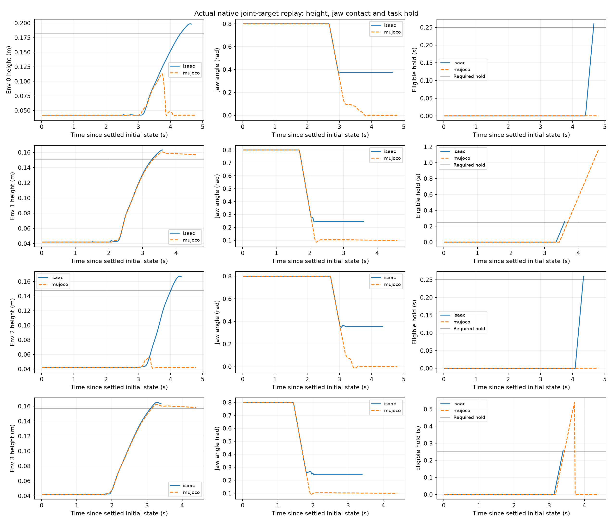

## PickPlace 与双相机视频

`pick_place/native.json` 使用 `1363bec`，依据实际 reset 状态规划接近、抓取、提升、搬运和放置路径。持物路径使用连续关节姿态及每步实际几何检查。原生执行使用重力补偿的位置控制，任务成功为 `1/1`，393 个控制步骤、7.86 秒，最高实际速度为 `1.500002 rad/s`。末步物体距离最终目标 `0.007012 m`，jaw 为 `0.796799 rad`，连续稳定时间为 `0.500000 秒`。

`pick_place/visualization.json` 保存实际轨迹图表及视频核查。视频为 overhead 与 wrist 相机输出，393 帧、50 fps、512×256，SHA256 为 `f3bf983ce939574f7bbe31e88991fa5d57d6038cc086207fae8cf6d8053f1f97`。完整 MP4 与 HDF5 保存在 `outputs/rl_progress/v4_place_1363bec_task/`。该检查属于 scripted IK 控制，RL 和多个初始场景的验收分别记录。

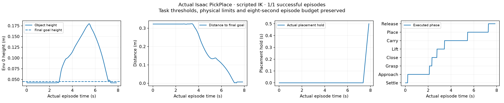
