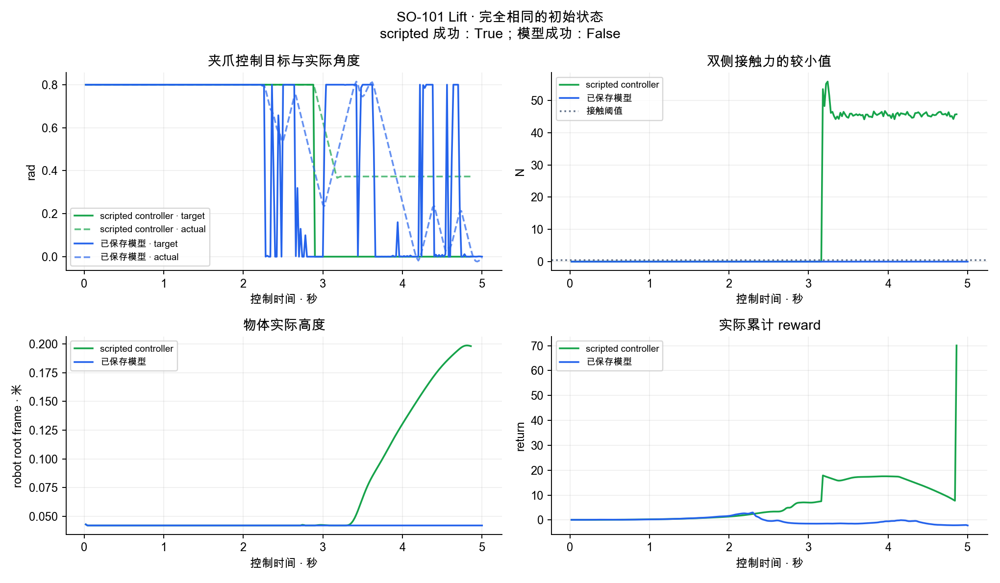
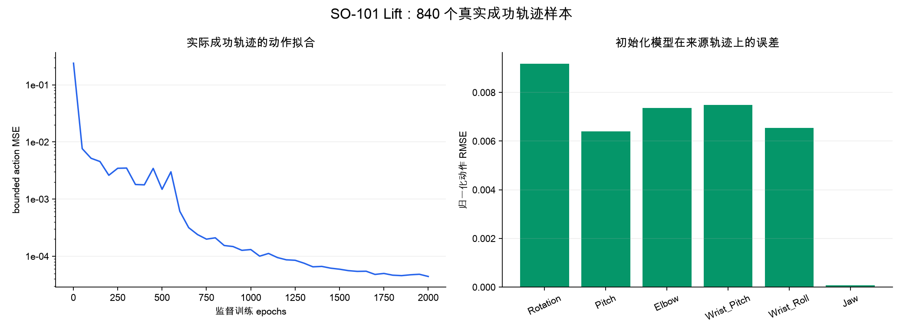
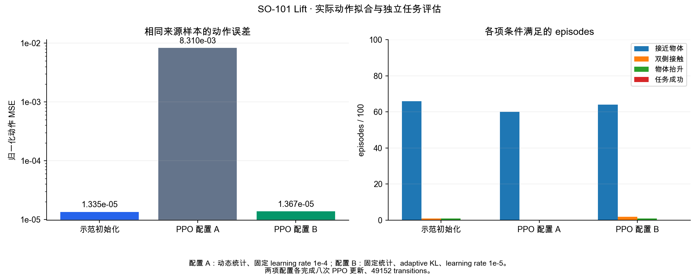
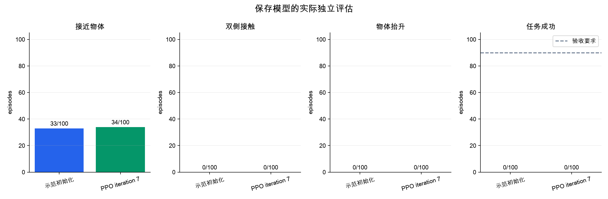
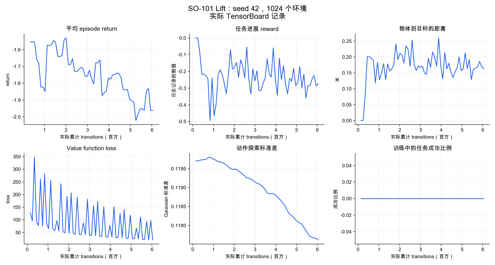
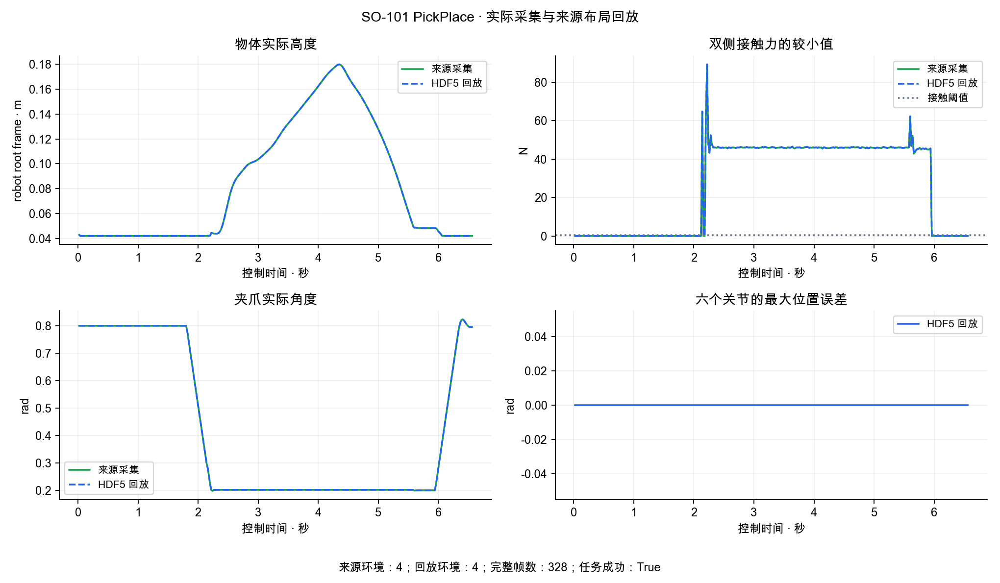

# 2026-10-06 至 2026-10-07 实际验证记录

## 双相机成功数据

| 文件 | 实际检查 | 结果 |
|---|---|---|
| [lift_capture.json](lift_capture.json) | Isaac scripted controller、四个实际环境 | Lift 4/4 |
| [lerobot_validation.json](lerobot_validation.json) | 完整成功 episode 的双相机 LeRobot 读取 | 243/243 帧、动作与关节观测转换误差为零 |
| [lift_replay.json](lift_replay.json) | 四环境录制到单环境的原生任务回放 | 243/243 帧、恢复与动作误差为零、实际 Lift 成功 |

原始数据位于 `jd_B300` 的 `outputs/rl_progress/lift_portable_dataset_20261006`。源 HDF5 SHA256 为 `34e06fb6e73f0b384357f8799eaa294e38e78911a0c9ef28c49b1644ca267fb0`；回放 HDF5 SHA256 为 `846873377ce913cbab470a9aaf3fd37371136d79ed044650420d34e7d174089f`。控制周期为 0.02 秒，物理周期为 0.001 秒。回放的 `task_success_verified=true`，完整物理轨迹重复性尚待验收。

## 保存模型的真实评估

| 文件 | 范围 | 结果 |
|---|---|---|
| [demonstration_initialization.json](demonstration_initialization.json) | 840 个实际成功示范样本、8000 gradient steps | bounded action MSE 4.64e-5 |
| [initial_policy_evaluation.json](initial_policy_evaluation.json) | 初始化模型独立 100 episodes | 成功 0/100、接近物体 33/100 |
| [evaluation_history.json](evaluation_history.json) | 八次 PPO 更新后独立 100 episodes | 成功 0/100、接近物体 34/100 |
| [initial_policy_paired.json](initial_policy_paired.json) | 来源成功 episode 的完全相同初始状态 | 250 步、任务未成功 |
| [initial_policy_paired.initial_observation.json](initial_policy_paired.initial_observation.json) | 实际恢复后的 38 维观测 | 最大误差为零 |
| [perturbed_expert.json](perturbed_expert.json) | 0.015 rad 控制扰动下的真实 expert 轨迹 | Lift 3/4 |
| [corrective_initialization.json](corrective_initialization.json) | 1529 个实际成功示范样本、12000 gradient steps | bounded action MSE 4.53e-5 |
| [corrective_evaluation.json](corrective_evaluation.json) | 八次 PPO 更新后独立 100 episodes | 成功 0/100、接近物体 32/100 |
| [control_audit.json](control_audit.json) | 保存模型对全部实际示范的动作预测 | arm 运动方向符合比例 77.63% |
| [lift_policy_mixture.json](lift_policy_mixture.json) | 已保存模型参与 15% 的实际控制 | expert 引导的 Lift 2/4、成功轨迹 424 帧 |
| [mixture_initialization.json](mixture_initialization.json) | 1953 个实际成功样本、16000 gradient steps | bounded action MSE 1.3352e-5 |
| [mixture_initial_evaluation.json](mixture_initial_evaluation.json) | 初始化模型独立 100 episodes | 成功 0/100、接近物体 66/100、双侧接触 1/100 |
| [mixture_evaluation_history.json](mixture_evaluation_history.json) | 八次 PPO 更新后独立 100 episodes | 成功 0/100、接近物体 60/100 |
| [mixture_paired_control.json](mixture_paired_control.json) | 同一成功示范的完整初始状态 | 38 维观测误差为零、250 步、任务未成功 |
| [mixture_final_control_audit.json](mixture_final_control_audit.json) | PPO 后模型对全部实际示范的动作预测 | action MSE 0.0083099 |
| [normalization_audit.json](normalization_audit.json) | 实际 actor 与实际归一化统计的前向计算 | PPO actor 使用初始统计时 MSE 0.0035923 |
| [fixed_normalization_statistics.json](fixed_normalization_statistics.json) | 八次 PPO 更新后的全部十个保存模型 | actor、critic 的全部八项统计保持一致 |
| [fixed_normalization_control.json](fixed_normalization_control.json) | 最终模型对全部 1953 个实际样本的预测 | action MSE 1.3670e-5 |
| [fixed_normalization_evaluation.json](fixed_normalization_evaluation.json) | 固定统计配置的 100 episodes 独立评估 | 成功 0/100、接近物体 64/100、双侧接触 2/100 |
| [continued_evaluation.json](continued_evaluation.json) | 1024 环境完成 100 次 PPO 更新后的独立评估 | iteration 107、成功 0/100 |
| [comparison_stopped.json](comparison_stopped.json) | 完成比较后的实际 worker 停止与模型检查 | 已保存模型 SHA256 保持一致 |
| [single_gpu_training.json](single_gpu_training.json) | 计算与图形进程的实际 NVIDIA 记录 | 全部仅使用物理 GPU 2 |
| [coverage_initialization.json](coverage_initialization.json) | 九条成功 episode、三条完整失败监督过程、2703 个实际样本 | 22000 gradient steps、action MSE 1.2786e-5 |
| [coverage_control.json](coverage_control.json) | 八次 PPO 更新后的模型对全部 2703 个实际样本的预测 | action MSE 1.5824e-5 |
| [coverage_normalization.json](coverage_normalization.json) | 全部十一个保存模型 | actor、critic 的八项归一化统计逐项相同 |
| [coverage_evaluation.json](coverage_evaluation.json) | 完整失败过程监督配置的独立 100 episodes | 成功 0/100、接近物体 70/100 |

示范拟合与任务成功各自验收。扰动轨迹使用 `expert_policy_action` 作为 actor 标签，`policy_action` 保存实际执行动作，reward 使用真实执行 transition。各报告保留对应数据范围；coverage 配置同时读取完整失败过程中的实际 expert 标签，并分别记录成功与失败数量。

[paired_curve_report.json](paired_curve_report.json) 保存相同初始状态下的实际逐步数值与来源 SHA256。模型没有形成双侧接触。归一化前向诊断只测量参数与统计对输出的影响，任务成功使用原生仿真记录。

[control_figure.json](control_figure.json) 使用相同的 1953 个实际来源样本和每次 100 episodes 的独立评估生成动作误差与任务条件图。配置 A 使用动态统计与固定 1e-4 learning rate；配置 B 使用固定统计、adaptive KL 与 1e-5 learning rate。两项配置均完成八次 PPO 更新、49152 transitions；任务成功均为零。

[training_snapshot.json](training_snapshot.json) 保存单张 GPU 继续训练的实际事件数值与 SHA256。图中 iteration 68 对应累计 6,045,696 transitions；任务成功比例为零。

## PickPlace 物理记录

[pick_place_complete.json](pick_place_complete.json) 在四个实际环境中全部完成任务，分别使用 328、329、349、286 个控制步骤，均在标准八秒任务时间内完成。物体进入目标、夹爪释放后执行 Cartesian retreat，当前步骤连续稳定 0.5 秒后成功结束。首条成功 HDF5 包含 328 帧，SHA256 为 `a25b2f915b0d1c7424a31c90fcf56845a8da56a4d7b8db65c530cbae84f3ff04`；双相机 MP4 SHA256 为 `f9d687110fd44582a6614bc084bfc7e609ed81507702da68c0c08b386a26048c`。

[pick_place_complete_plan.json](pick_place_complete_plan.json) 保存完整基础路径检查与 64 点撤离路径采样。基础路径数值、实际初始状态、官方模型和 collision bundle 的 SHA256 全部保存；几何采样与任务成功各自验收。

[pick_place_complete_lerobot.json](pick_place_complete_lerobot.json) 核查此条成功数据的全部 328 帧双相机读取，动作与状态转换误差为零。[pick_place_complete_replay.json](pick_place_complete_replay.json) 完成单环境的全部 328 帧回放，恢复与动作误差为零，任务成功为 false。[pick_place_replay_diagnostic.json](pick_place_replay_diagnostic.json) 保存实际接触与关节状态：来源有 189 个双侧接触步骤，回放只有一个；arm 位置 RMSE 为 0.0003–0.0038 rad，jaw 为 0.1598 rad。接触物理重复性仍需通过验收。

[pick_place_cohort_replay.json](pick_place_cohort_replay.json) 使用完整来源四环境、相同 seed、相同布局和实际 policy actions 执行全部轨迹。四个环境均完成任务，成功步骤与双侧接触数量均与来源相同；初始 policy 观测和实际关节目标误差为零。该报告保留四环境的实际轨迹 SHA256 与任务配置范围。

[pick_place_cohort_capture.json](pick_place_cohort_capture.json) 保存包含完整并行状态的新双相机采集，四个实际环境全部成功，首个环境包含 328 帧。[pick_place_cohort_lerobot.json](pick_place_cohort_lerobot.json) 读取全部帧，动作与关节观测转换误差为零。[pick_place_cohort_dataset_replay.json](pick_place_cohort_dataset_replay.json) 恢复来源四环境并完成全部帧，恢复字段和全部环境的关节目标误差为零，`task_success_verified=true`，稳定放置时间为 0.5 秒。[pick_place_cohort_gpu.json](pick_place_cohort_gpu.json) 的实际计算与图形进程仅使用物理 GPU 2。

[pick_place_cohort_diagnostic.json](pick_place_cohort_diagnostic.json) 比较首个来源环境的全部 328 个实际控制步骤：关节位置、速度、物体位置和双侧接触力误差均为零，双侧接触步骤同为 189。全部实际数值、来源 SHA256 与回放 SHA256 保存在报告中。[isaac_replay_figure.json](isaac_replay_figure.json) 保存实际图表检查和文件 SHA256。

[task_success_guard.json](task_success_guard.json) 使用来源成功数据在真实 Isaac 中执行一个控制步骤，保存恢复、动作、相机与任务报告。实际任务未完成时返回退出状态 1，并释放仿真进程。该检查保留单帧范围，完整单环境任务仍单独验收。

[pick_place_release.json](pick_place_release.json) 在四个实际环境中完成 3/4。成功需要物体进入最终目标、夹爪释放、实际速度达到要求并连续稳定 0.5 秒。源成功 HDF5 为 374 帧，SHA256 为 `41ffb912eccd4b2ec355facd0f9e82d73ba3cf7f3cfbdd41062ee631371643ad`；双相机 MP4 SHA256 为 `324a3292f1a34af2a8c5072021bfcdd3c0a0fb116b36ac3dcbcd25ea00bcb7c4`。

[pick_place_release_diagnostics.json](pick_place_release_diagnostics.json) 保存实际释放后的速度与稳定时间。速度来自 action 前的真实 policy 观测，保持时间来自 action 后的真实 termination。剩余环境完成 65 个释放步骤，最长稳定时间为 0.14 秒。

[pick_place_lerobot.json](pick_place_lerobot.json) 核查成功 episode 的全部 374 帧双相机读取；动作与关节观测转换误差为零，最大时间戳误差为 2.29e-7 秒。[pick_place_replay.json](pick_place_replay.json) 在单个 Isaac 环境回放四环境来源的全部 374 帧，状态恢复与动作误差为零，实际连续稳定放置时间达到 0.5 秒，`task_success_verified=true`。完整物理轨迹重复性尚待验收。

## 规划与程序验证

[pick_place_plan.json](pick_place_plan.json) 记录四个实际环境的 PickPlace waypoint 与完整路径采样结果，四个环境均通过运动学检查。该报告中的 `continuous_collision_path_verified=false` 和 `task_success_verified=false` 保留各自的验收范围。

[planner_geometry.json](planner_geometry.json) 比较 MuJoCo 的 840 个真实 recorded poses 和 2759 个 contacts，最大 pose 与 contact 误差均为零，缓存重新构建的模型参数完全一致。

[native_regressions.json](native_regressions.json) 保存 Isaac 原生环境的实际 pytest 结果与源码版本，进程内部的检查结果为零。[原生日志](native_regressions.log) 包含 44 项通过与四项未执行。

[键盘终端日志](keyboard_terminal.log) 保存原生双相机采集时的真实 PTY 操作，涵盖 checkpoint 保存、HDF5 恢复、键盘目标误差为零和取消 episode 后正常退出。该记录没有人工任务成功的验收结果。

全部 GPU 工作限定物理 GPU 2。当前源码、继续训练和待完成验收见 [开发状态](../../guides/v2-status-2026-10-06.md)。
