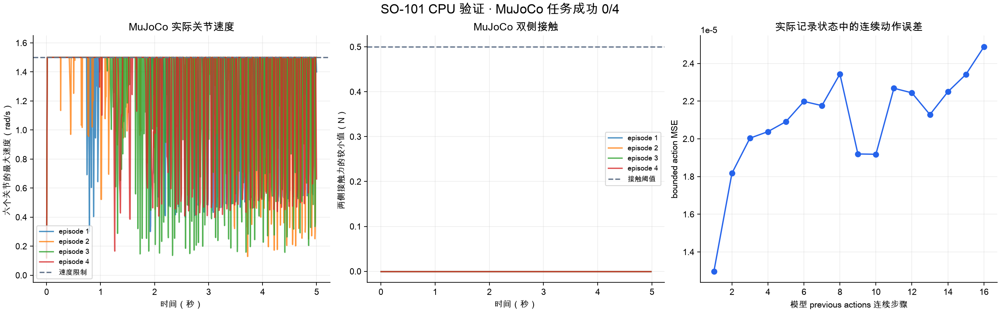

# CPU 准备验收 · 2026-10-07

`jd_B300` 的统一 CPU 验收完成十个步骤。运行入口禁止 CUDA；MuJoCo 使用 OSMesa，LeRobot 使用实际 FFmpeg 与 TorchCodec。全部来源模型、轨迹、optimizer、历史报告和视频继续保存。服务器报告使用 UTC 时间，末尾时间为 2026-10-08。

## 实际检查

- 49 项检查全部通过，包含实际 mesh、USD 文件、容器内部区域、场景修改、六物体 BDDL 目标、checkpoint 保持时间、MP4 标定、源码与报告检查、真实子进程停止。
- 64 个实际记录姿态提供 512 次键盘 IK 检查；每次输出符合关节范围并减小指定运动目标的误差。四项终端检查使用实际 PTY。
- 十个场景 bundle 通过文件 SHA256、TaskIntent、TaskProgram 与静态几何检查。
- PickPlace LeRobot 数据完成 328 帧全部读取，两个相机逐帧解码，动作与状态转换的最大误差为零。来源属于完成任务的 scripted controller。
- 实际 CPU renderer 生成并解码 MP4，八个拟合点与四个独立验证点完成相机标定；独立位置的最大误差为 0.82 mm。真实用户视频的测量与重建继续等待验收。
- 2703 帧实际示范提供 2523 个连续窗口。来源模型的首步输出逐项一致；实际 previous actions 连续前向计算、Jacobian 与 gradient 更新完成检查。
- 读取来源模型、Adam optimizer 和 22216 次历史监督更新，完成两次 CPU 更新。全部帧 action MSE 从 1.33694e-5 到 1.32460e-5，观测归一化统计保持原值，新增 RL transitions 为零。
- 已有导出策略在 MuJoCo 完成四个 episode 和 20,000 个物理步骤。实际速度低于 1.5 rad/s，力矩符合来源限制，预测与实际速度误差为零。实际任务成功为 0/4。
- 项目 GPU 进程数量为零。实际占用检查保存了阻止工作程序启动的记录。
- 空闲设备检查与启动登记使用禁止 CUDA 的实际 CPU worker 验证，四项 PTY 检查完成后子进程结束。记录见 [CPU worker 启动](idle_cpu_guard.json) 与 [CPU worker 结果](idle_cpu_guard_worker.json)。



图表使用实际 HDF5 与来源报告生成，保存图像、轨迹、报告和生成程序 SHA256。MuJoCo 图表对应导出策略 `v4_seed44_99_b49353f_portable`，连续动作图表对应 `lift_corrective_coverage_continue_20261007` 的最终保存模型。

## 记录

[统一 CPU 记录](suite.json) 保存十个步骤、源码和配置的 SHA256、每个输入、日志与报告 SHA256。报告分别保存在 [键盘 IK](keyboard_ik.json)、[终端输入](terminal_keyboard.json)、[场景检查](scene_batch.json)、[LeRobot 数据](lerobot.json)、[视频标定](metric_video.json)、[连续策略](policy_history.json)、[连续监督](demonstration_updates.json)、[MuJoCo 策略](mujoco_policy.json)、[项目设备查询](gpu_inventory.json) 和 [源码检查](source_checks.json)。完整日志、HDF5、检查后的 CPU 模型、MP4 和 JUnit 文件位于服务器 `outputs/rl_progress/v2_cpu_preparation_20261007/`。

源码的 Python 编译、Shell 语法和七份 RL 配置的 Pydantic 检查均已完成。GPU 阶段保留未执行状态，原生物理运行、人工成功采集、合格 RL teacher、成功策略的 sim2sim、视觉 student 与真机任务各自需要实际验收。

[正式报告核查](published_report_validation.json) 逐项确认十份报告的 SHA256 与统一 CPU 记录相同，并且记录中的源码快照与当前代码相同。

## 执行方式

在服务器的唯一项目代码目录中执行 CPU 阶段，输出需要使用尚未存在的目录：

```bash
OPENSO101_REPO="$PWD" bash scripts/run_cpu_python.sh mujoco \
  scripts/run_v2_suite.py configs/validation/v2_preparation.json \
  --phase cpu --output outputs/rl_progress/v2_cpu_preparation_20261007/suite_verified
```

GPU 阶段检查同一份 CPU 记录及相同源码、配置与输入，然后逐项执行原生程序检查、十个场景运行和保存策略的初始状态验证。设备使用方式见 [GPU 使用与停止控制](../../../guides/gpu-usage.md)。本次没有执行 GPU 阶段。
