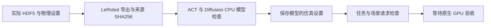

# IL 来源物理设置与 CPU 验证

源码版本为 `4dc4f6a0d6da0c7da4e8d223be261bfcf31dfc02`。统一流程通过全部 20 个 CPU 阶段，独立 Linux CI 通过 129 项检查、四项 CUDA 请求检查，以及实际 sdist、wheel 验证。源码包含 199 个模块和 910 处项目 import。全部 31 份报告及 SHA256 保存在 [verification.json](verification.json)。

## 来源参数

实际 PickPlace 来源记录的参数为 50 Hz、`physics_dt=0.001`、`decimation=20`、`grasp_v4`、`nominal` 和 `reward_discount=0.99`。同步与异步 LeRobot 导出各读取全部 328 帧，完整保存来源物理设置、任务和文件 SHA256；动作与状态转换误差为零，编码线程全部关闭。[导出报告](suite/lerobot_export/report.json) 保存实际来源。

ACT 与 Diffusion 的完整 CPU 模型分别包含 51,597,190 和 266,622,758 个参数。forward、backward、保存、processors 恢复和实际动作推理全部通过，IL optimizer 更新次数为零。两个模型保存相同的实际物理设置、256×256 双相机、六个关节名称、动作单位、metadata 与导出来源 SHA256。[ACT](models/act.json) 和 [Diffusion](models/diffusion.json) 保留全部配置与测量结果。

每个模型使用 48 帧真实双相机与关节记录，在三个环境、两个批次中执行 16 次连续动作推理。共享入口与实际 LeRobot 推理的最大误差为零，模型与 processors 文件保持不变。两个不一致的任务请求和模型目录中的报告请求均在启动 Isaac 前终止。[推理报告](suite/il_evaluation/report.json) 保存来源、步骤和请求检查。

## 录制与回放

HDF5 checkpoint 保留来源物理设置，磁盘与内存恢复覆盖全部 29 个状态字段。直接 LeRobot 录制完成同步、异步的 336 帧、三个 episode 检查。真实 PickPlace 来源的全部 328 帧完成 1,312 次环境坐标转换，最大误差为 `5.960464477539063e-8` 米；quaternion、线速度和角速度保持一致。

标准任务与 CustomScene 策略录制共用 `teleop/simulation.py` 的来源参数。CustomScene 保存对应 bundle、场景 SHA256 和相对路径。原生场景恢复与策略录制继续等待对应运行。

## 验收状态

键盘 IK、十个已有场景、CPU renderer 视频标定、视觉 student 推理与模型历史检查通过。MuJoCo 已保存策略完成四个 episode、1,000 个控制步骤和 20,000 个物理步骤；速度与力矩限制通过，任务成功为 0/4。[策略报告](suite/mujoco_policy/report.json) 保存实际参数与结果。

[GPU 进程报告](suite/gpu_inventory.json) 确认本项目没有 GPU 作业，其它项目保持运行。GPU 计算和 RL 训练保持停止。九个原生步骤、成功策略 sim2sim、人工键盘任务成功、真实视频恢复和真机验收仍然待执行。报告保持 `gpu_tests_started=false`、`native_physics_verified=false` 和 `full_v2_verified=false`。
